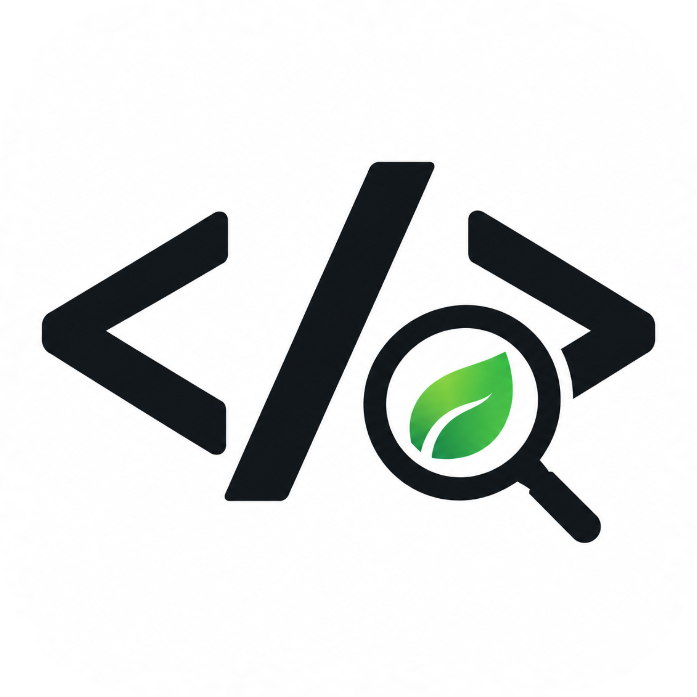
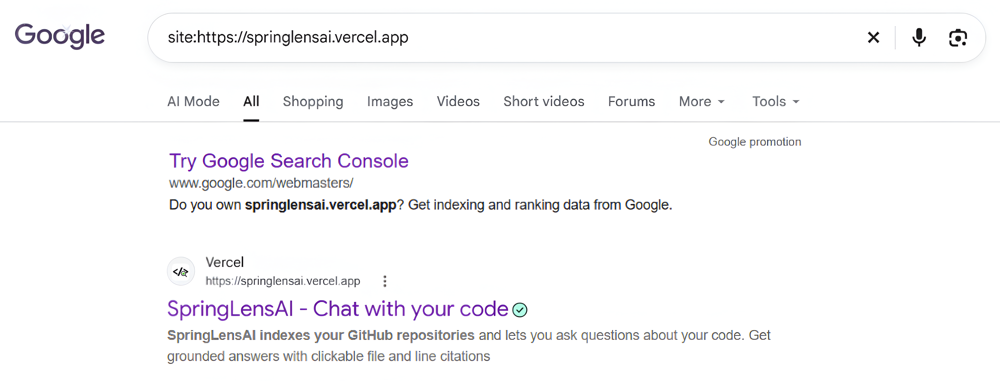
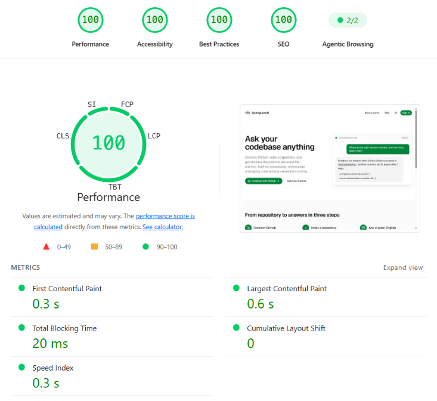
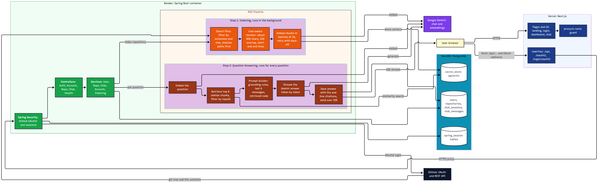
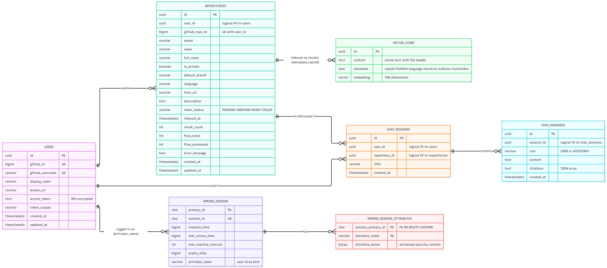
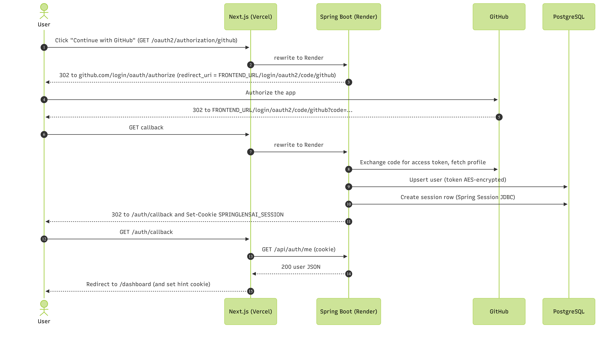
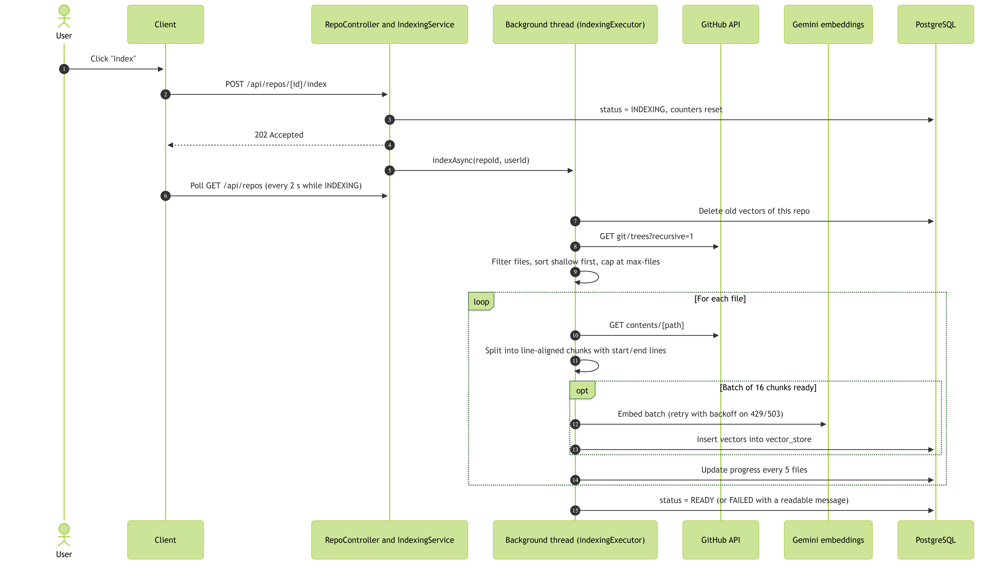
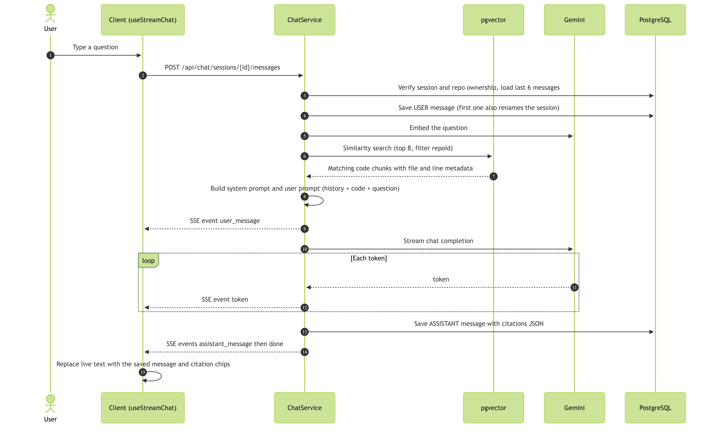
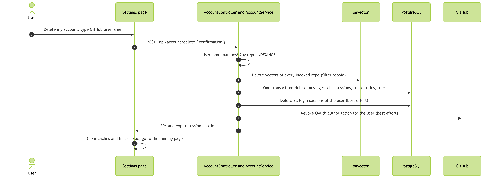

<h1 id="springlensai-title" align="center" width="100%"><br/>SpringLensAI</h1>

<h2 width="100%" align="center">
<a href="https://springlensai.vercel.app">


</a>
<br/>
<a href="./LICENSE">
  
</a>
</h2>

<div id="springlensai-description">
  <h2><a href="#readme-index">SpringLensAI - Chat With Your Code.</a></h2>
  <h3>SpringLensAI is a full-stack, production-ready AI code assistant that lets developers have a conversation with their GitHub repositories. Answers are generated by Google Gemini, a Large Language Model (LLM), using Retrieval-Augmented Generation (RAG).<br/>
  Users sign in with GitHub, index any public or private repository they can access, and ask questions in plain English. Answers are generated by Google Gemini using Retrieval-Augmented Generation (RAG). The code is split into line-aware chunks, embedded with Gemini embeddings, stored in PostgreSQL with pgvector, and the most relevant chunks are retrieved for every question. Each answer is grounded only in the user's own code and lists the exact files and line ranges it came from. The platform features GitHub OAuth2 authentication with sessions persisted in PostgreSQL, one-click background indexing with live progress, real-time token-by-token streaming over Server-Sent Events (SSE), multiple chat sessions with conversation memory, AES-encrypted GitHub token storage, permanent account deletion that erases all user data and revokes the GitHub authorization, rate-limit retries, crash recovery, and a same-origin proxy architecture that keeps login cookies first-party in every browser. Built with a layered Spring Boot (Java) backend and a Next.js frontend with shadcn/ui, it ships with a multi-stage Docker image, a Render blueprint, Vercel deployment, SEO-optimized pages, and a modern, fully responsive light and dark UI/UX.<br/>
  The goal is to help developers understand any codebase faster, with answers they can verify.</h3>
</div>

<div id="springlensai-live">
  <h2>
    <a href="https://springlensai.vercel.app" target="_blank" rel="noopener noreferrer">
      <p>SpringLensAI </p>
      <p>🌐 Live URL: https://springlensai.vercel.app</p>
    </a>
  </h2>
</div>

<!-- <div id="springlensai-preview-image">
  <h2>
    <a href="https://springlensai.vercel.app" target="_blank" rel="noopener noreferrer">
      <p> SpringLensAI Preview</p>
    </a>
    
  </h2>
</div> -->

<div id="seo-result">
  <h2>
    <a href="https://www.google.com/search?q=site:springlensai.vercel.app" target="_blank" rel="noopener noreferrer">
      <p>SpringLensAI SEO Visibility </p>
      <p>📈 Click here to see the SEO Visibility/Result</p>
    </a>
    <div width="100%">
      <table width="95%" align="center" border="0">
        <tr width="100%">
          <td width="100%" colspan="2" align="center">
            <h5>Production-Grade SEO, Indexing & Web Performance Implementation</h5>
            
          </td>
        </tr>
      </table>
    </div>
  </h2>
</div>

<div id="performance">
  <h2>
    <a href="https://omkarardekar12.github.io/SpringLensAI/reports/lighthouse-report/" target="_blank" rel="noopener noreferrer">
      <p> SpringLensAI Performance</p>
      <p>📊 Click here to see the Lighthouse Detailed Performance Report</p>
    </a>
    <div width="100%">
      <table width="95%" align="center" border="0">
        <tr width="100%">
          <td width="100%" colspan="2" align="center">
            <h5>Production-Grade, Live-Measured Web Performance & SEO Validation</h5>
            
          </td>
        </tr>
      </table>
    </div>
  </h2>
</div>

---

<div>
  <h2 id="readme-index"><a href="#springlensai-title">Table of Content 📑</a></h2>
  <h3>
    <ol>
      <li><a href="#springlensai-description">Description</a></li>
      <li><a href="#springlensai-live">Live Application</a></li>
      <!-- <li><a href="#springlensai-preview-image">Demo / Preview Video</a></li> -->
      <li><a href="#overview">Overview</a></li>
      <li><a href="#features">Features</a></li>
      <li><a href="#technologies-used">Technologies Used / Tech Stack</a></li>
      <li><a href="#system-architecture">System Architecture of SpringLensAI</a></li>
      <li><a href="#database-design">SpringLensAI Database Design</a></li>
      <li><a href="#folder-file-structure">Folders and Files Structure</a></li>
      <li><a href="#environment-variables">Environment Variables Configuration</a></li>
      <li><a href="#installation">Installation</a></li>
      <li><a href="#diagrams">Structure Flow Diagrams</a></li>
      <li><a href="#license">License</a></li>
      <li><a href="#author">Author</a></li>
    </ol>
  </h3>
</div>

---

<div>
  <h2 id="overview"><a href="#readme-index">Overview 🖥️</a></h2>
  <h3>SpringLensAI is a full-stack, production-ready AI code assistant that lets developers have a conversation with their GitHub repositories. Answers are generated by Google Gemini, a Large Language Model (LLM), using Retrieval-Augmented Generation (RAG).<br/>
  Instead of grepping through files for hours, a developer signs in with GitHub, indexes a repository, and asks questions such as "Where is the login session created and how long does it last?" or "Which classes talk to the GitHub API?". The system retrieves the most relevant pieces of the code and asks Gemini to answer using only those pieces, so every answer is grounded and verifiable. If the indexed code does not contain the answer, the assistant says it is unsure instead of guessing. <br/>
  The browser only talks to the Next.js application (Vercel). Next.js forwards API and OAuth traffic to the Spring Boot server (Render), which authenticates users through GitHub OAuth2, stores users, repositories and chats in PostgreSQL (NeonDB), downloads repository files through the GitHub API, converts code chunks into vectors with Gemini embeddings, stores them in pgvector, and streams Gemini answers back to the browser over Server-Sent Events. <br/>
  The goal is to help developers understand any codebase faster, with answers they can verify.</h3>
</div>

---

<div>
  <h2 id="features"><a href="#readme-index">Features ✨</a></h2>
  <table border="1">
    <thead>
      <tr>
        <th>S.No.</th>
        <th>Feature</th>
        <th>Description</th>
      </tr>
    </thead>
    <tbody>
      <tr>
        <td>1.</td>
        <td><b>GitHub OAuth2 Authentication & Persistent Sessions</b></td>
        <td>One-click sign in with GitHub using Spring Security OAuth2 (authorization code flow). Login sessions are stored in PostgreSQL with Spring Session JDBC, so users stay signed in for 7 days even when the server restarts or a free-tier instance goes to sleep. Session cookies are HttpOnly, Secure in production and SameSite=Lax. Logout invalidates the session on the server.</td>
      </tr>
      <tr>
        <td>2.</td>
        <td><b>Repository Sync</b></td>
        <td>Lists every repository the user can access (owned, collaborator, organization and private) with language, default branch and privacy information. Sync is protected by a per-user lock to avoid duplicates.</td>
      </tr>
      <tr>
        <td>3.</td>
        <td><b>One-Click Background Indexing with Live Progress</b></td>
        <td>Indexing runs on a background thread pool and the API answers <code>202 Accepted</code> immediately. The UI shows files processed, total files and chunk count, polling only while a repository is indexing. Failed jobs show a readable reason with a retry button.</td>
      </tr>
      <tr>
        <td>4.</td>
        <td><b>Smart File Selection & Line-Aware Chunking</b></td>
        <td>Indexes source code, configuration and documentation up to 100 KB per file. Dependencies, build output, lock files, minified bundles, source maps and dot-files such as <code>.env</code> are skipped. A custom chunker splits files on line boundaries with overlap, and every chunk remembers its start and end line.</td>
      </tr>
      <tr>
        <td>5.</td>
        <td><b>LLM-Powered Retrieval-Augmented Generation (RAG) with Gemini and pgvector</b></td>
        <td>Code chunks are embedded with <code>gemini-embedding-001</code> (768 dimensions) and stored in PostgreSQL with pgvector (HNSW index, cosine distance). For every question the top 8 most similar chunks of that repository are retrieved and sent to Gemini Flash with strict grounding rules.</td>
      </tr>
      <tr>
        <td>6.</td>
        <td><b>Real-Time Streaming Chat</b></td>
        <td>Answers stream token by token over Server-Sent Events (SSE) using a custom fetch-based SSE client, with a Stop button, optimistic user messages, auto-scroll, copy button and Markdown rendering with syntax-highlighted code blocks.</td>
      </tr>
      <tr>
        <td>7.</td>
        <td><b>Source Citations with File and Line Ranges</b></td>
        <td>Every answer lists the files and line ranges it used, stored with the message as JSON and rendered as clickable chips that open the exact lines on GitHub.</td>
      </tr>
      <tr>
        <td>8.</td>
        <td><b>Chat Sessions & Conversation Memory</b></td>
        <td>Multiple chat sessions per repository. The last 6 messages are included in the prompt so follow-up questions work. A session is automatically titled from the first question.</td>
      </tr>
      <tr>
        <td>9.</td>
        <td><b>Account Management & Permanent Account Deletion</b></td>
        <td>Profile view, light, dark and system theme, logout, and permanent account deletion with a typed-username confirmation. Deletion erases vectors, messages, chat sessions, repositories, the user, all login sessions, and revokes the GitHub OAuth authorization. GitHub repositories are never modified.</td>
      </tr>
      <tr>
        <td>10.</td>
        <td><b>Secure Token Storage & Authorization</b></td>
        <td>GitHub access tokens are AES-encrypted at rest and never sent to the browser. Every repository and chat lookup is scoped to the signed-in user, and vector search is filtered by repository id, so users can never read other users' data. A single immutable HTTP client attaches each user's token per request to prevent token mix-ups.</td>
      </tr>
      <tr>
        <td>11.</td>
        <td><b>Resilience: Rate-Limit Retries, Crash Recovery, Cold-Start Handling</b></td>
        <td>Gemini batches are retried with exponential back-off on 429/503. Repositories left in INDEXING by a restart are marked FAILED on startup so the user can retry. The landing page wakes a sleeping Render instance, and the app shows a "waking up the server" state and retries with back-off instead of logging the user out.</td>
      </tr>
      <tr>
        <td>12.</td>
        <td><b>Same-Origin Proxy Architecture</b></td>
        <td>Next.js <code>rewrites</code> forward <code>/api/*</code>, <code>/oauth2/*</code> and <code>/login/oauth2/*</code> to Spring Boot, so the session cookie is first-party and works in Safari and Chrome even with third-party cookies blocked. No CORS is needed in the browser.</td>
      </tr>
      <tr>
        <td>13.</td>
        <td><b>REST API (Application Programming Interface)</b></td>
        <td>Modular Spring MVC controllers (Auth, Account, Repository, Chat, Health) exposing 16 endpoints, Bean Validation on request DTOs, a centralized exception handler with a uniform JSON error shape, and actuator health probes. Internal error details are logged and never sent to the browser.</td>
      </tr>
      <tr>
        <td>14.</td>
        <td><b>Responsive UI/UX</b></td>
        <td>Modern, mobile-first, fully responsive interface built with Next.js, Tailwind CSS and shadcn/ui, with light and dark themes, a collapsible sidebar, skeleton loading states, toasts and accessible components.</td>
      </tr>
      <tr>
        <td>15.</td>
        <td><b>SEO and Web Optimization</b></td>
        <td>Metadata with title template, canonical URLs, Open Graph and Twitter cards, Schema.org JSON-LD (SoftwareApplication and FAQPage), <code>robots.txt</code>, <code>sitemap.xml</code>, web app manifest, icons, semantic HTML, and <code>noindex</code> on private pages.</td>
      </tr>
      <tr>
        <td>16.</td>
        <td><b>Containerized Deployment</b></td>
        <td>Multi-stage Docker image (Maven build, slim JRE, non-root user, memory-friendly JVM flags), docker-compose for PostgreSQL with pgvector, a Render Web Service (Docker) or Blueprint (<code>render.yaml</code>) for the backend and Vercel deployment for the Next.js client.</td>
      </tr>
    </tbody>
  </table>
</div>

---

<div>
  <h2 id="technologies-used"><a href="#readme-index">Technologies Used 💻🛠️</a></h2>
  <p>

![Java](https://img.shields.io/badge/Java-ED8B00?style=for-the-badge&logo=data:image/svg+xml;base64,PHN2ZyB4bWxucz0iaHR0cDovL3d3dy53My5vcmcvMjAwMC9zdmciIHZpZXdCb3g9IjAgMCAxMjggMTI4Ij48cGF0aCBmaWxsPSIjMDA3NEJEIiBkPSJNNTIuNTgxIDY3LjgxN3MtMy4yODQgMS45MTEgMi4zNDEgMi41NTdjNi44MTQuNzc4IDEwLjI5Ny42NjYgMTcuODA1LS43NTMgMCAwIDEuOTc5IDEuMjM3IDQuNzM1IDIuMzA5LTE2LjgzNiA3LjIxMy0zOC4xMDQtLjQxOC0yNC44ODEtNC4xMTN6bS0yLjA1OS05LjQxNXMtMy42ODQgMi43MjkgMS45NDUgMy4zMTFjNy4yOC43NTEgMTMuMDI3LjgxMyAyMi45NzktMS4xMDMgMCAwIDEuMzczIDEuMzk2IDMuNTM2IDIuMTU3LTIwLjM1MiA1Ljk1NC00My4wMjEuNDY5LTI4LjQ2LTQuMzY1eiIvPjxwYXRoIGZpbGw9IiNFQTJEMkUiIGQ9Ik02Ny44NjUgNDIuNDMxYzQuMTUxIDQuNzc4LTEuMDg4IDkuMDc0LTEuMDg4IDkuMDc0czEwLjUzMy01LjQzNyA1LjY5Ni0xMi4yNDhjLTQuNTE5LTYuMzQ5LTcuOTgyLTkuNTAyIDEwLjc3MS0yMC4zNzguMDAxIDAtMjkuNDM4IDcuMzUtMTUuMzc5IDIzLjU1MnoiLz48cGF0aCBmaWxsPSIjMDA3NEJEIiBkPSJNOTAuMTMyIDc0Ljc4MXMyLjQzMiAyLjAwNS0yLjY3OCAzLjU1NWMtOS43MTYgMi45NDMtNDAuNDQ0IDMuODMxLTQ4Ljk3OS4xMTctMy4wNjYtMS4zMzUgMi42ODctMy4xODcgNC40OTYtMy41NzYgMS44ODctLjQwOSAyLjk2NS0uMzM0IDIuOTY1LS4zMzQtMy40MTItMi40MDMtMjIuMDU1IDQuNzE5LTkuNDY5IDYuNzYyIDM0LjMyNCA1LjU2MyA2Mi41NjctMi41MDYgNTMuNjY1LTYuNTI0em0tMzUuOTctMjYuMTM0cy0xNS42MjkgMy43MTMtNS41MzQgNS4wNjNjNC4yNjQuNTcgMTIuNzU4LjQzOSAyMC42NzYtLjIyNSA2LjQ2OS0uNTQzIDEyLjk2MS0xLjcwNCAxMi45NjEtMS43MDRzLTIuMjc5Ljk3OC0zLjkzIDIuMTA0Yy0xNS44NzQgNC4xNzUtNDYuNTMzIDIuMjMtMzcuNzA2LTIuMDM4IDcuNDYzLTMuNjExIDEzLjUzMy0zLjIgMTMuNTMzLTMuMnpNODIuMiA2NC4zMTdjMTYuMTM1LTguMzgyIDguNjc0LTE2LjQzOCAzLjQ2Ny0xNS4zNTMtMS4yNzMuMjY2LTEuODQ1LjQ5Ni0xLjg0NS40OTZzLjQ3NS0uNzQ0IDEuMzc4LTEuMDYzYzEwLjMwMi0zLjYyIDE4LjIyMyAxMC42ODEtMy4zMjIgMTYuMzQ1IDAgMCAuMjQ3LS4yMjQuMzIyLS40MjV6Ii8+PHBhdGggZmlsbD0iI0VBMkQyRSIgZD0iTTcyLjQ3NCAxLjMxM3M4LjkzNSA4LjkzOS04LjQ3NiAyMi42ODJjLTEzLjk2MiAxMS4wMjctMy4xODQgMTcuMzEzLS4wMDYgMjQuNDk4LTguMTUtNy4zNTQtMTQuMTI4LTEzLjgyOC0xMC4xMTgtMTkuODUyIDUuODg5LTguODQyIDIyLjIwNC0xMy4xMzEgMTguNi0yNy4zMjh6Ii8+PHBhdGggZmlsbD0iIzAwNzRCRCIgZD0iTTU1Ljc0OSA4Ny4wMzljMTUuNDg0Ljk5IDM5LjI2OS0uNTUxIDM5LjgzMi03Ljg3OCAwIDAtMS4wODIgMi43NzctMTIuNzk5IDQuOTgxLTEzLjIxOCAyLjQ4OC0yOS41MjMgMi4xOTktMzkuMTkxLjYwMyAwIDAgMS45OCAxLjY0IDEyLjE1OCAyLjI5NHoiLz48cGF0aCBmaWxsPSIjRUEyRDJFIiBkPSJNOTQuODY2IDEwMC4xODFoLS40NzJ2LS4yNjRoMS4yN3YuMjY0aC0uNDd2MS4zMTdoLS4zMjlsLjAwMS0xLjMxN3ptMi41MzUuMDY2aC0uMDA2bC0uNDY4IDEuMjUxaC0uMjE2bC0uNDY1LTEuMjUxaC0uMDA1djEuMjUxaC0uMzEydi0xLjU4MWguNDU3bC40MzEgMS4xMTkuNDMyLTEuMTE5aC40NTR2MS41ODFoLS4zMDJ2LTEuMjUxem0tNDQuMTkgMTQuNzljLTEuNDYgMS4yNjYtMy4wMDQgMS45NzgtNC4zOTEgMS45NzgtMS45NzQgMC0zLjA0NS0xLjE4Ni0zLjA0NS0zLjA4NSAwLTIuMDU1IDEuMTQ2LTMuNTYgNS43MzgtMy41NmgxLjY5N3Y0LjY2N2guMDAxem00LjAzMSA0LjU0OHYtMTQuMDc3YzAtMy41OTktMi4wNTMtNS45NzMtNi45OTctNS45NzMtMi44ODYgMC01LjQxNi43MTQtNy40NzMgMS42MjJsLjU5MiAyLjQ5M2MxLjYyLS41OTUgMy43MTUtMS4xNDcgNS43NzEtMS4xNDcgMi44NSAwIDQuMDc1IDEuMTQ3IDQuMDc1IDMuNTIxdjEuNzc5aC0xLjQyNGMtNi45MjEgMC0xMC4wNDQgMi42ODUtMTAuMDQ0IDYuNzIzIDAgMy40NzkgMi4wNTggNS40NTYgNS45MzMgNS40NTYgMi40OSAwIDQuMzUxLTEuMDI4IDYuMDg4LTIuNTMzbC4zMTYgMi4xMzdoMy4xNjN2LS4wMDF6bTEzLjQ1MiAwaC01LjAyN2wtNi4wNTEtMTkuNjg5aDQuMzkxbDMuNzU2IDEyLjA5OS44MzUgMy42MzVjMS44OTYtNS4yNTggMy4yNC0xMC41OTYgMy45MTItMTUuNzMzaDQuMjcxYy0xLjE0MyA2LjQ4MS0zLjIwMyAxMy41OTgtNi4wODcgMTkuNjg4em0xOS4yODgtNC41NDhjLTEuNDY1IDEuMjY2LTMuMDEgMS45NzgtNC4zOTIgMS45NzgtMS45NzYgMC0zLjA0Ni0xLjE4Ni0zLjA0Ni0zLjA4NSAwLTIuMDU1IDEuMTQ5LTMuNTYgNS43MzYtMy41NmgxLjcwMXY0LjY2N2guMDAxem00LjAzMyA0LjU0OHYtMTQuMDc3YzAtMy41OTktMi4wNTktNS45NzMtNi45OTktNS45NzMtMi44ODkgMC01LjQxOC43MTQtNy40NzUgMS42MjJsLjU5MyAyLjQ5M2MxLjYyLS41OTUgMy43MTgtMS4xNDcgNS43NzQtMS4xNDcgMi44NDYgMCA0LjA3NCAxLjE0NyA0LjA3NCAzLjUyMXYxLjc3OWgtMS40MjRjLTYuOTIzIDAtMTAuMDQ1IDIuNjg1LTEwLjA0NSA2LjcyMyAwIDMuNDc5IDIuMDU2IDUuNDU2IDUuOTMgNS40NTYgMi40OTEgMCA0LjM0OS0xLjAyOCA2LjA5MS0yLjUzM2wuMzE4IDIuMTM3aDMuMTYzdi0uMDAxem0tNTYuNjkzIDMuMzQ2Yy0xLjE0NyAxLjY3OS0zLjAwNSAzLjAwOC01LjAzNyAzLjc1N2wtMS45ODktMi4zNDVjMS41NDctLjc5NCAyLjg3Mi0yLjA3NSAzLjQ4OS0zLjI2OS41MzItMS4wNjMuNzUzLTIuNDMuNzUzLTUuNzAxVjkyLjg5MWg0LjI4NHYyMi4xNzNjMCA0LjM3NS0uMzQ4IDYuMTQ0LTEuNSA3Ljg2N3oiLz48L3N2Zz4=&logoColor=white)


 <br/>


 <br/>


 <br/>


 <br/>


  </p>

  <div>
    <table border="1">
      <thead>
        <tr>
          <th>#</th>
          <th>Category</th>
          <th>Technologies / Tools</th>
        </tr>
      </thead>
      <tbody>
        <tr>
          <td>&#10148;</td>
          <td>Frontend</td>
          <td>Next.js (App Router, Turbopack, <code>rewrites</code> proxy, <code>proxy.ts</code> route guard), React, TypeScript, Tailwind CSS, shadcn/ui built on Base UI, TanStack Query (server state, polling, mutations, retry and back-off), next-themes (light, dark and system theme), Streamdown (streaming-safe Markdown and code highlighting), React Icons, date-fns, class-variance-authority, custom fetch-based SSE client, Optimistic UI Updates, Fully Responsive UI/UX</td>
        </tr>
        <tr>
          <td>&#10148;</td>
          <td>Backend</td>
          <td>Java, Spring Boot, Spring MVC (REST controllers and <code>SseEmitter</code>), Spring Security, Spring Data JPA, Hibernate, Bean Validation, Spring Boot Actuator, Spring <code>RestClient</code>, Jackson, Lombok, Maven (wrapper included), layered architecture (controller, service, repository, entity), centralized exception handling, async executor for background jobs</td>
        </tr>
        <tr>
          <td>&#10148;</td>
          <td>AI and Retrieval</td>
          <td>Large Language Model (LLM), Generative AI, Spring AI, Google Gemini chat model (Gemini Flash), Gemini embeddings (<code>gemini-embedding-001</code>, 768 dimensions), pgvector vector store (HNSW index, cosine distance), custom line-aware code chunker, RAG pipeline with metadata filtering per repository, prompt builder with conversation memory and prompt-injection guard</td>
        </tr>
        <tr>
          <td>&#10148;</td>
          <td>Database</td>
          <td>PostgreSQL (NeonDB serverless in production, Docker or pgAdmin locally), pgvector, <code>hstore</code>, <code>uuid-ossp</code>, Hibernate schema auto-update, Spring Session JDBC tables</td>
        </tr>
        <tr>
          <td>&#10148;</td>
          <td>Authentication & Security</td>
          <td>GitHub OAuth2 (scopes <code>read:user</code>, <code>repo</code>), Spring Security OAuth2 Client, Spring Session JDBC (sessions in PostgreSQL), AES token encryption (Spring Security Crypto <code>Encryptors.text</code>), HttpOnly, Secure and SameSite cookies, user-scoped authorization on every query, Bean Validation, uniform JSON errors without internal details, security headers</td>
        </tr>
        <tr>
          <td>&#10148;</td>
          <td>Architecture & Design</td>
          <td>Same-origin proxy through Next.js rewrites, layered backend architecture, RESTful API structure, Server-Sent Events streaming, background indexing pipeline, startup configuration checker, graceful shutdown, environment-based configuration, stateless web tier with sessions in the database</td>
        </tr>
        <tr>
          <td>&#10148;</td>
          <td>APIs Integrated</td>
          <td>Custom REST APIs (SpringLensAI): Authentication, Account, Repositories, Chat, Health.<br/>External APIs: GitHub OAuth2, GitHub REST API (repositories, git trees, file contents, OAuth grant revocation), Google Gemini API (chat and embeddings).</td>
        </tr>
        <tr>
          <td>&#10148;</td>
          <td>SEO (Search Engine Optimization) & Website Optimization</td>
          <td>Next.js Metadata API (title template, description, keywords, canonical URL), Open Graph and Twitter Card tags, Schema.org JSON-LD (SoftwareApplication, FAQPage), robots.txt, sitemap.xml, web app manifest, app icons and OG images, <code>noindex</code> for private pages, semantic HTML, server-rendered landing page, <code>next/font</code>, HTTPS (via Vercel and Render)</td>
        </tr>
        <tr>
          <td>&#10148;</td>
          <td>Development Tools & Libraries</td>
          <td>Maven Wrapper, JUnit, ESLint, TypeScript compiler, Docker, Docker Compose, Git, GitHub</td>
        </tr>
        <tr>
          <td>&#10148;</td>
          <td>Deployment & Hosting</td>
          <td>Vercel (Frontend Hosting), Render (Backend Hosting as a Web Service (Docker) or Blueprint (<code>render.yaml</code>)), NeonDB (Database Hosting), GitHub (Source and OAuth)</td>
        </tr>
      </tbody>
    </table>
  </div>
</div>

---

<div>
  <h2 id="system-architecture"><a href="#readme-index">System Architecture of SpringLensAI ⌨️🏗️</a></h2>
  <div width="90%" align="center">
    
  </div>
</div>

---

<div>
  <h2 id="database-design"><a href="#readme-index">SpringLensAI Database Design 💾🗃️</a></h2>
  <div width="90%" align="center">
    
  </div>
</div>

---

<div>
  <h2 id="folder-file-structure"><a href="#readme-index">Folders & Files Structure 📂🗄️</a></h2>

```bash
📂 SpringLensAI
├── 📁 server
│   ├── 📁 src
│   ├── 📁 .mvn
│   ├── Dockerfile
│   ├── .dockerignore
│   ├── .env
│   ├── .gitignore
│   ├── .gitattributes
│   ├── mvnw
│   ├── mvnw.cmd
│   └── pom.xml
├── 📁 client
│   ├── 📁 src
│   ├── 📁 public
│   ├── .env.local
│   ├── .gitignore
│   ├── components.json
│   ├── eslint.config.mjs
│   ├── next.config.ts
│   ├── package.json
│   ├── package-lock.json
│   ├── postcss.config.mjs
│   ├── tsconfig.json
│   ├── README.md
│   └── 📁 node_modules
├── 📁 docker
├── 📁 docs
├── docker-compose.yml
├── render.yaml
├── .gitignore
├── LICENSE
└── README.md
```

</div>

---

<div>
  <h2 id="environment-variables"><a href="#readme-index">Environment Variables Configuration ⚙️</a></h2>
  <div>

To run **SpringLensAI** successfully, configure the required environment variables for both the **server** and the **client**.

### 1. Server (Backend) Configuration

Create a `.env` file inside the **server** directory:

```bash
cd server
touch .env
```

`server/.env`

```bash
DATABASE_URL=jdbc:postgresql://localhost:5432/springlensai or jdbc:postgresql://YOUR-NEON-HOST/springlensai?sslmode=require&channel_binding=require
DATABASE_USERNAME=postgres or your_neon_username
DATABASE_PASSWORD=postgres or your_neon_password
GEMINI_API_KEY=your_gemini_api_key
GITHUB_CLIENT_ID=your_github_oauth_client_id
GITHUB_CLIENT_SECRET=your_github_oauth_client_secret
TOKEN_ENCRYPTOR_PASSWORD=your_long_random_password
TOKEN_ENCRYPTOR_SALT=your_hex_salt
FRONTEND_URL=http://localhost:3000
CORS_ALLOWED_ORIGINS=http://localhost:3000
COOKIE_SECURE=false
DB_POOL_SIZE=8
INDEX_MAX_FILE_BYTES=102400
INDEX_MAX_FILES=400
INDEX_CHUNK_SIZE=800
INDEX_CHUNK_OVERLAP=100
INDEX_EMBED_DELAY_MS=250
INDEX_EMBED_MAX_RETRIES=5
GITHUB_API_DELAY_MS=50
```

### 2. Client (Frontend) Configuration

Create a `.env.local` file inside the **client** directory:

```bash
cd client
touch .env.local
```

`client/.env.local`

```bash
BACKEND_URL=http://localhost:8080
NEXT_PUBLIC_API_URL=http://localhost:8080
NEXT_PUBLIC_SITE_URL=http://localhost:3000
```

---

<div>
  <h2 id="installation"><a href="#readme-index">Installation 💽📩</a></h2>
  <div>

Requirements: Java, Node.js, npm, Git, Bash, and a PostgreSQL database with pgvector (run with Docker or with pgAdmin / any PostgreSQL URL).

### Step 1: Clone the Repository

```bash
git clone https://github.com/OmkarArdekar12/SpringLensAI.git
cd SpringLensAI
```

### Step 2: Prepare the Database (choose one)

**Option A: Docker (PostgreSQL with pgvector)**

Requires Docker Desktop (running). From the project root:

```bash
docker compose up -d
docker compose ps
```

**Option B: pgAdmin / PostgreSQL URL**

Use this if PostgreSQL (with pgvector) is already installed, or if you have a hosted PostgreSQL URL.

1. In pgAdmin create a database named `springlensai`.
2. Open the **Query Tool** on that database and run:

```sql
CREATE EXTENSION IF NOT EXISTS vector;
CREATE EXTENSION IF NOT EXISTS hstore;
CREATE EXTENSION IF NOT EXISTS "uuid-ossp";
```

### Step 3: Start the Backend

```bash
cd server
export $(grep -v '^#' .env | xargs)
./mvnw clean spring-boot:run
```

### Step 4: Start the Frontend

Open a **second terminal**:

```bash
cd client
npm install
npm run dev
```

  </div>
</div>

---

<div>
  <h2 id="diagrams"><a href="#readme-index">Structure Flow Diagrams 📊</a></h2>
  <div width="100%">
    <table width="95%" align="center" border="0">
      <tr>
        <td width="90%" colspan="2" align="center">
          <h3 align="center">Sign in with GitHub</h3>
          
        </td>
      </tr>
      <tr>
        <td width="90%" colspan="2" align="center">
          <h3 align="center">RAG Step 1: Repository Indexing</h3>
          
        </td>
      </tr>
      <tr>
        <td width="90%" colspan="2" align="center">
          <h3 align="center">RAG Step 2: Question Answering & Streaming</h3>
          
        </td>
      </tr>
      <tr>
        <td width="90%" colspan="2" align="center">
          <h3 align="center">Delete Account</h3>
          
        </td>
      </tr>
    </table>
</div>

---

<div>
  <h2 id="license"><a href="#readme-index">License 📄</a></h2>
  <div>

### This project is licensed under the terms of the **_MIT License_**.

### See the [LICENSE](./LICENSE) file for more information.

  </div>
</div>

---

<div>
  <h2 id="author"><a href="#readme-index">Author 👨‍💻</a></h2>
  <div>

### Omkar Ardekar 💻

[](https://github.com/OmkarArdekar12)
[](https://www.linkedin.com/in/omkarardekar09)
[](https://omkarardekar.vercel.app)

  </div>
</div>

<br/>
<hr/><hr/>
