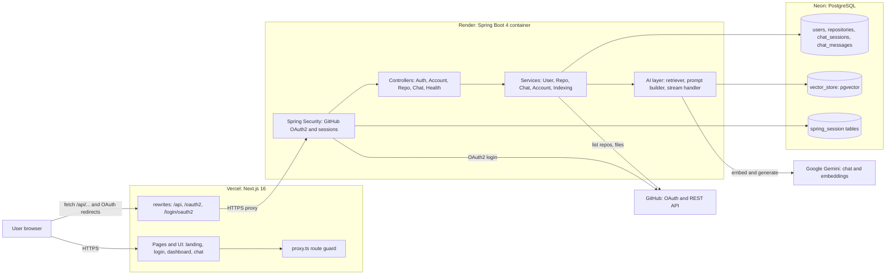
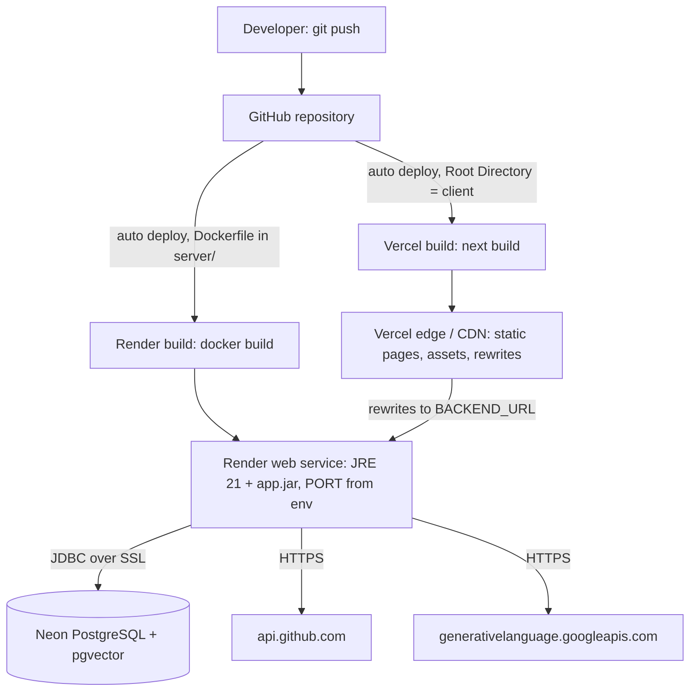
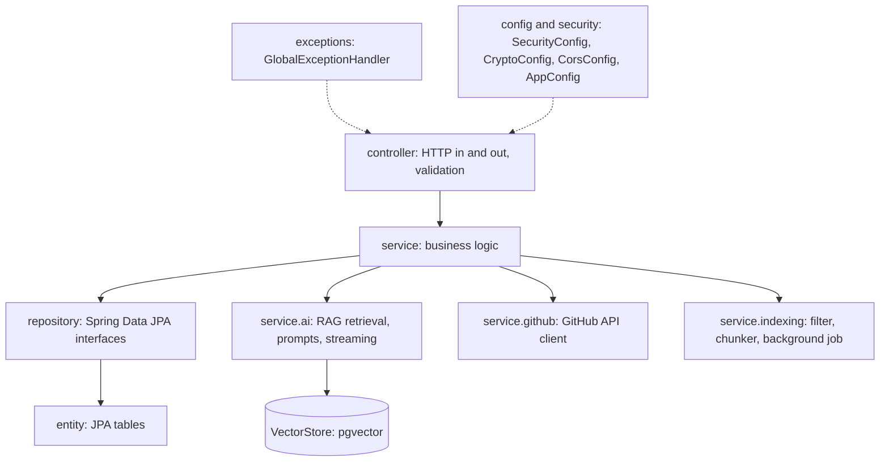
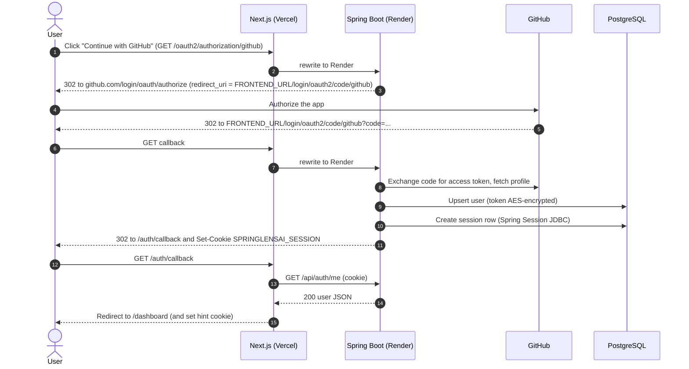
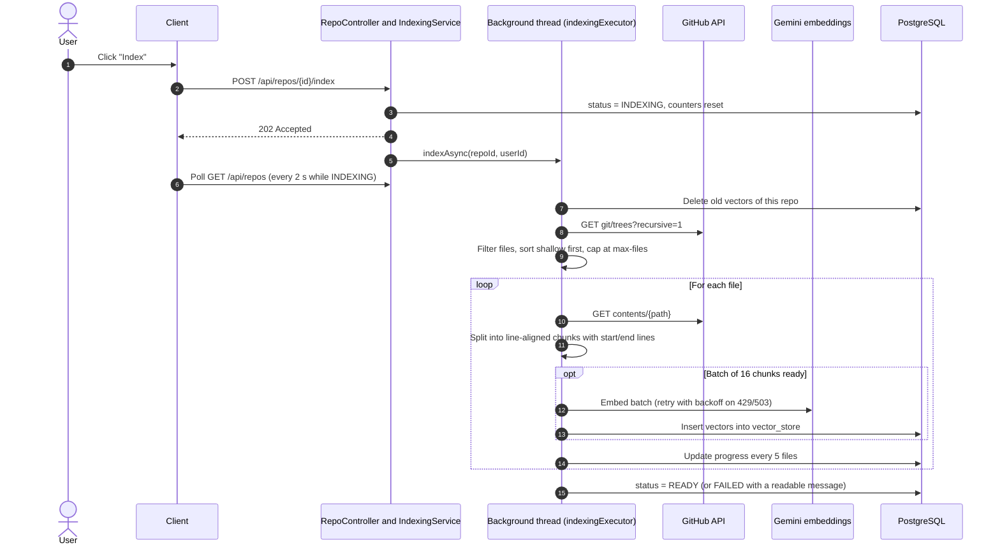
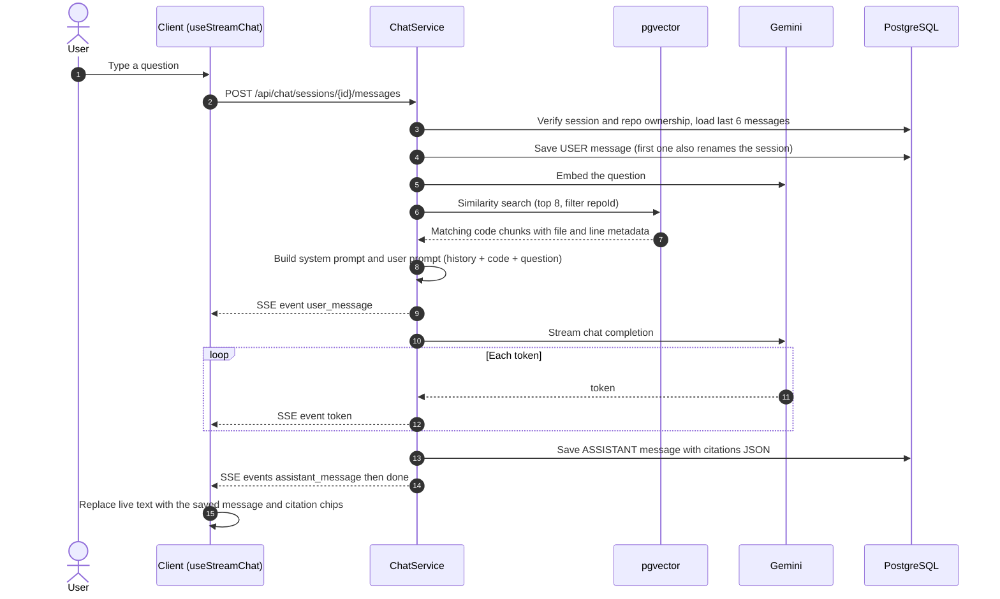
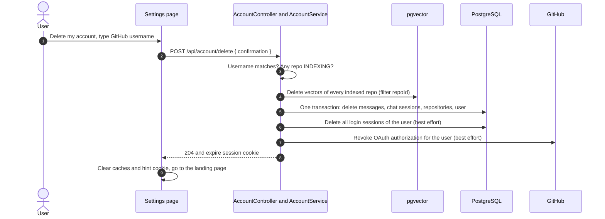
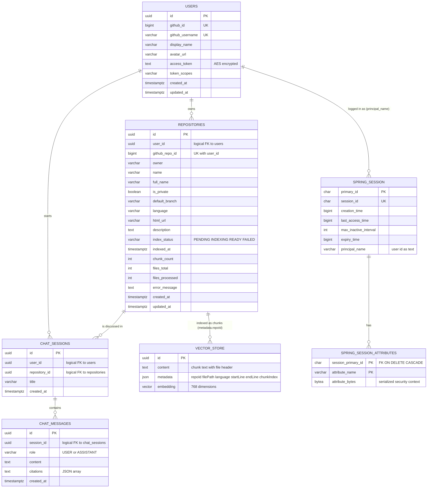
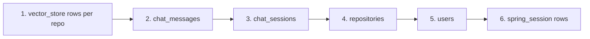

# SpringLens AI

> **Chat with your GitHub code.** Sign in with GitHub, index a repository, and ask questions in plain English. Answers are generated by Google Gemini from _your code only_ and link to the exact **file and line range** they came from.

---

## Table of contents

1. [Description](#1-description)
2. [Features](#2-features)
3. [Tech stack (detailed)](#3-tech-stack-detailed)
4. [System architecture](#4-system-architecture)
5. [Detailed flows (sequence diagrams)](#5-detailed-flows)
6. [Database design](#6-database-design)
7. [RAG pipeline design](#7-rag-pipeline-design)
8. [REST API reference](#8-rest-api-reference)
9. [Frontend design](#9-frontend-design)
10. [Security design](#10-security-design)
11. [SEO](#11-seo)
12. [Project structure](#12-project-structure)
13. [Configuration (environment variables)](#13-configuration-environment-variables)
14. [Run locally](#14-run-locally)
15. [Deploy to production (Neon + Render + Vercel)](#15-deploy-to-production)
16. [Testing and verification](#16-testing-and-verification)
17. [Operational notes, limits and costs](#17-operational-notes-limits-and-costs)
18. [Troubleshooting](#18-troubleshooting)
19. [Customization checklist](#19-customization-checklist)
20. [Roadmap](#20-roadmap)
21. [Documentation index, credits and license](#21-documentation-index-credits-and-license)

---

## 1. Description

### 1.1 What is SpringLens AI?

SpringLens AI is a full-stack web application that lets a developer **have a conversation with a GitHub repository**. The user signs in with GitHub, picks one of their repositories (public or private), and the system reads the source code, builds a searchable index of it, and then answers natural-language questions such as:

- _"Where is the login session created and how long does it last?"_
- _"How does the indexing job report progress?"_
- _"Which classes talk to the GitHub API?"_

Every answer is **grounded**: the model is only given code that was retrieved from the user's repository, and each answer lists the files and line ranges it used, so the user can verify it on GitHub.

### 1.2 The problem it solves

- Joining a project, reviewing a pull request or revisiting old code usually means hours of grepping and clicking through files.
- General-purpose chatbots do not know your private code, and when they guess they hallucinate.
- SpringLens AI uses **Retrieval-Augmented Generation (RAG)**: it first _retrieves_ the most relevant pieces of your code, then asks the model to answer _only_ from them. If the code does not contain the answer, the assistant says it is unsure.

### 1.3 Who is it for?

Developers onboarding to unfamiliar codebases, reviewers, maintainers of legacy code, and teams who want a quick "ask the repo" tool.

### 1.4 How it works in one paragraph

The browser talks only to a **Next.js** app (Vercel). Next.js forwards API and OAuth traffic to a **Spring Boot** server (Render). Spring Boot authenticates users through **GitHub OAuth2**, stores users, repositories and chats in **PostgreSQL (Neon)**, downloads repository files through the **GitHub API**, converts code chunks into vectors with **Gemini embeddings**, stores them in **pgvector**, and answers questions by retrieving similar chunks and streaming a **Gemini** response back to the browser over **Server-Sent Events**.

### 1.5 Origin

The project follows the architecture of the _DevPilot_ tutorial project (Spring Boot + Next.js + OpenAI) but replaces OpenAI with the free-tier-friendly **Gemini** API, and adds production-hardening, deployment configuration, SEO and account deletion. See [`docs/PROJECT_GUIDE.md`](docs/PROJECT_GUIDE.md) for a file-by-file comparison with the tutorial.

---

## 2. Features

| Area                 | Feature                                                                                                                                                                                                    |
| -------------------- | ---------------------------------------------------------------------------------------------------------------------------------------------------------------------------------------------------------- |
| Authentication       | GitHub OAuth2 login; server-side sessions stored in PostgreSQL (survive restarts); secure, HttpOnly, SameSite cookie; logout                                                                               |
| Repositories         | Sync all repos you can access (owned, collaborator, organization, private); language, privacy, branch info                                                                                                 |
| Indexing             | One-click background indexing; live progress (files processed / total, chunk count); retry on failure; automatic recovery of jobs interrupted by a restart                                                 |
| Smart file selection | Indexes source, config and docs up to 100 KB; skips dependencies, build output, lock files, minified bundles, source maps and dot-files such as `.env`                                                     |
| Chat                 | Multiple chat sessions per repo; streaming answers (token by token); Markdown and syntax-highlighted code blocks; conversation memory for follow-up questions; session auto-titled from the first question |
| Citations            | Every answer lists the files and **line ranges** used, linking to the code                                                                                                                                 |
| Account management   | Profile view, dark/light/system theme, logout, **permanent account deletion** (erases all data and revokes the GitHub authorization)                                                                       |
| Production readiness | Docker image, Render blueprint, Vercel config, health checks, graceful shutdown, cold-start handling, rate-limit retries, friendly error messages                                                          |
| SEO                  | Metadata, Open Graph, Twitter cards, JSON-LD (SoftwareApplication + FAQPage), sitemap, robots, manifest, `noindex` on private pages                                                                        |

### 2.1 Feature matrix (what, where, and how)

Legend: **FE** = frontend file under `client/src/`, **BE** = backend file under `server/src/main/java/com/springlensai/server/`, **DB** = tables touched.

| #   | Feature                                 | What the user gets                                                                                                                | FE                                                                                                   | BE                                                                                                                           | DB                                              |
| --- | --------------------------------------- | --------------------------------------------------------------------------------------------------------------------------------- | ---------------------------------------------------------------------------------------------------- | ---------------------------------------------------------------------------------------------------------------------------- | ----------------------------------------------- |
| 1   | **GitHub sign-in**                      | One-click login with GitHub; no passwords                                                                                         | `app/login/page.tsx`, `app/auth/callback/page.tsx`, `hooks/use-auth.ts`                              | `config/SecurityConfig`, `security/GithubOAuth2UserService`, `service/UserService`                                           | `users`, `spring_session*`                      |
| 2   | **Persistent sessions**                 | Stay signed in for 7 days, even after the server restarts or sleeps                                                               | `components/providers/require-auth.tsx`                                                              | Spring Session JDBC (`application.properties`), `security/AppUserPrincipal`                                                  | `spring_session`, `spring_session_attributes`   |
| 3   | **Route protection**                    | Private pages redirect signed-out visitors to the login page; a sleeping server is not mistaken for "signed out"                  | `proxy.ts`, `require-auth.tsx`                                                                       | `SecurityConfig` (401 for `/api/**`)                                                                                         | -                                               |
| 4   | **Log out**                             | Ends the session on the server and clears the browser state                                                                       | `hooks/use-auth.ts` (`useLogout`), `components/dashboard/settings-dashboard.tsx`                     | `SecurityConfig` (logout handler)                                                                                            | `spring_session`                                |
| 5   | **Repository sync**                     | All repos you can access (owned, collaborator, organization, private) listed with language, branch and privacy                    | `components/dashboard/repo-dashboard.tsx`, `repo-card.tsx`, `hooks/use-repos.ts`                     | `service/RepoService`, `service/github/GithubApiClient`, `controller/RepoController`                                         | `repositories`                                  |
| 6   | **One-click indexing**                  | Start indexing a repo and keep using the app while it runs                                                                        | `repo-card.tsx` (`useStartIndexing`)                                                                 | `service/indexing/IndexingService` (`@Async`), `RepoController` (`202 Accepted`)                                             | `repositories`, `vector_store`                  |
| 7   | **Live indexing progress**              | Progress bar with files processed / total and chunk count                                                                         | `repo-status.tsx`, `hooks/use-repos.ts` (polls every 2 s only while indexing)                        | `IndexingService` (progress every 5 files), `RepoService.status`                                                             | `repositories`                                  |
| 8   | **Smart file selection**                | Only useful files are indexed; `node_modules`, build output, lock files, minified bundles and `.env` files are skipped            | -                                                                                                    | `service/indexing/CodeFileFilter`                                                                                            | -                                               |
| 9   | **Line-aware chunking**                 | Chunks keep their start and end line, which makes precise citations possible                                                      | -                                                                                                    | `service/indexing/CodeChunker`                                                                                               | `vector_store.metadata`                         |
| 10  | **Gemini embeddings and vector search** | Fast semantic search over your code                                                                                               | -                                                                                                    | `service/ai/CodeContextRetriever`, pgvector (HNSW, cosine)                                                                   | `vector_store`                                  |
| 11  | **Rate-limit resilience**               | Indexing retries with exponential back-off when Gemini limits are hit; clear failure messages                                     | `components/dashboard/index-error-alert.tsx`                                                         | `IndexingService.embedAndStore`, `service/ai/AiErrors`                                                                       | `repositories.error_message`                    |
| 12  | **Crash recovery**                      | A repo can never be stuck on "Indexing" after a restart; it becomes "Failed" with a retry option                                  | `repo-card.tsx` (retry)                                                                              | `IndexingService.failInterruptedJobs` (runs on startup)                                                                      | `repositories`                                  |
| 13  | **Chat sessions**                       | Several conversations per repository, newest first, auto-titled from your first question                                          | `components/chat/chat-sidebar.tsx`, `chat-view.tsx`, `hooks/use-chat.ts`                             | `service/ChatService`, `controller/ChatController`                                                                           | `chat_sessions`                                 |
| 14  | **Streaming answers**                   | Text appears token by token, with a Stop button                                                                                   | `lib/stream-chat.ts`, `hooks/use-chat.ts` (`useStreamChat`), `chat-composer.tsx`                     | `service/ai/ChatStreamHandler` (Server-Sent Events)                                                                          | `chat_messages`                                 |
| 15  | **Grounded answers (RAG)**              | Answers use only retrieved code from the selected repo; the model says when it is unsure                                          | -                                                                                                    | `ChatService.streamReply`, `service/ai/ChatPromptBuilder`                                                                    | `vector_store`                                  |
| 16  | **Conversation memory**                 | Follow-up questions such as "and where is that used?" work                                                                        | -                                                                                                    | `ChatPromptBuilder` (last 6 messages)                                                                                        | `chat_messages`                                 |
| 17  | **Citations with line ranges**          | Each answer lists the files and line ranges it came from                                                                          | `components/chat/citation-chips.tsx`                                                                 | `service/ai/CitationMapper`, `RetrievedContext`                                                                              | `chat_messages.citations`                       |
| 18  | **Markdown and code highlighting**      | Readable formatted answers with fenced, highlighted code                                                                          | `chat-markdown.tsx` (+ `.css`), Streamdown                                                           | -                                                                                                                            | -                                               |
| 19  | **Dashboard overview**                  | Totals and recent repository activity                                                                                             | `components/dashboard/overview-dashboard.tsx`                                                        | `RepoController` (list endpoint)                                                                                             | `repositories`                                  |
| 20  | **Profile and appearance**              | See your GitHub profile; light / dark / system theme                                                                              | `settings-dashboard.tsx`, `components/ui/mode-toggle.tsx`, `providers/theme-provider.tsx`            | `AuthController` (`/api/auth/me`)                                                                                            | `users`                                         |
| 21  | **Delete account**                      | Permanently erases your account and all your data after typing your username; revokes the app on GitHub; signs you out everywhere | `components/dashboard/delete-account-card.tsx`, `hooks/use-auth.ts` (`useDeleteAccount`)             | `controller/AccountController`, `service/AccountService`, `service/AccountDataEraser`, `GithubApiClient.revokeAuthorization` | all tables + `vector_store` + `spring_session*` |
| 22  | **Secure token storage**                | Your GitHub token is encrypted at rest and never sent to the browser                                                              | -                                                                                                    | `config/CryptoConfig`, `UserService`                                                                                         | `users.access_token`                            |
| 23  | **Friendly errors**                     | Clear messages instead of stack traces; rate limits explained                                                                     | toasts via `components/ui/toast.tsx`                                                                 | `exceptions/GlobalExceptionHandler`, `AiErrors`                                                                              | -                                               |
| 24  | **Cold-start handling**                 | Landing page wakes the sleeping server; app shows "waking up the server" instead of failing                                       | `components/marketing/backend-warmup.tsx`, `require-auth.tsx`                                        | `controller/HealthController`                                                                                                | -                                               |
| 25  | **Landing page**                        | Explains the product with a live-style preview, how it works, and an FAQ                                                          | `app/page.tsx`, `components/marketing/chat-preview.tsx`                                              | -                                                                                                                            | -                                               |
| 26  | **SEO**                                 | Rich search and social previews; private pages hidden from crawlers                                                               | `app/layout.tsx`, `robots.ts`, `sitemap.ts`, `manifest.ts`, `lib/site.ts`, JSON-LD in `app/page.tsx` | -                                                                                                                            | -                                               |
| 27  | **Same-origin API proxy**               | Login works in every browser, including Safari                                                                                    | `next.config.ts` (rewrites)                                                                          | `server.forward-headers-strategy=framework`                                                                                  | -                                               |
| 28  | **Health checks and graceful shutdown** | Reliable deploys on Render                                                                                                        | -                                                                                                    | Actuator probes, `server.shutdown=graceful`, `AppConfig` executor shutdown                                                   | -                                               |
| 29  | **Containerized deployment**            | Build once, run anywhere                                                                                                          | -                                                                                                    | `server/Dockerfile`, `render.yaml`, `docker-compose.yml`                                                                     | -                                               |

### 2.2 Feature status

| Status                                                                                        | Features                                                        |
| --------------------------------------------------------------------------------------------- | --------------------------------------------------------------- |
| Implemented and covered by the frontend build, type-check and proxy tests                     | 1-4, 13-20, 21 (UI), 23-27                                      |
| Implemented in backend code (syntax-checked; confirm with the first `./mvnw spring-boot:run`) | 5-12, 15-17, 21 (API), 22, 28-29                                |
| Planned (see [Roadmap](#20-roadmap))                                                          | Incremental re-indexing, hybrid search, quotas, team workspaces |

---

## 3. Tech stack (detailed)

### 3.1 Frontend (`client/`)

| Technology                                            | Version                      | Role in this project                                                                                                                                                                                                                                 |
| ----------------------------------------------------- | ---------------------------- | ---------------------------------------------------------------------------------------------------------------------------------------------------------------------------------------------------------------------------------------------------- |
| **Next.js** (App Router, Turbopack)                   | 16.3.7                       | Framework: routing, server rendering of the landing page, metadata/SEO, `rewrites` proxy to the API, `proxy.ts` route guard                                                                                                                          |
| **React**                                             | 19.2.8                       | UI library                                                                                                                                                                                                                                           |
| **TypeScript**                                        | 5.x                          | Static typing across the client                                                                                                                                                                                                                      |
| **Tailwind CSS**                                      | 4.x (`@tailwindcss/postcss`) | Utility-first styling; theme tokens in `globals.css`                                                                                                                                                                                                 |
| **shadcn/ui** on **Base UI** (`@base-ui/react` 1.8)   | shadcn CLI 4.21              | Accessible component kit living in `src/components/ui` (62 components; this project uses Button, Card, Accordion, AlertDialog, Avatar, Badge, Dialog-style overlays, Sidebar, Toast, Progress, ScrollArea, Skeleton, Spinner, Switch, Tooltip, etc.) |
| **TanStack Query**                                    | 5.104                        | Server-state cache, polling while a repo is indexing, mutations, retry/backoff                                                                                                                                                                       |
| **next-themes**                                       | 0.4.6                        | Light / dark / system theme without flash                                                                                                                                                                                                            |
| **Streamdown** + `@streamdown/code`                   | 2.x / 1.x                    | Streaming-safe Markdown renderer and code highlighting for chat answers                                                                                                                                                                              |
| **lucide-react**, **react-icons**                     | 1.49 / 5.7                   | Icons (UI icons and per-language icons)                                                                                                                                                                                                              |
| `cn` (+ `class-variance-authority`, `tw-animate-css`) | 0.4 / 0.7 / 1.4              | Class-name merging and component variants/animations                                                                                                                                                                                                 |
| ESLint (`eslint-config-next`)                         | 9.x                          | Linting                                                                                                                                                                                                                                              |

### 3.2 Backend (`server/`)

| Technology                                         | Version   | Role in this project                                                                |
| -------------------------------------------------- | --------- | ----------------------------------------------------------------------------------- |
| **Java**                                           | 21 (LTS)  | Language/runtime (records, pattern matching)                                        |
| **Spring Boot**                                    | 4.1.1     | Application framework, auto-configuration, embedded Tomcat                          |
| **Spring MVC** (`spring-boot-starter-webmvc`)      | 7.x       | REST controllers, SSE (`SseEmitter`)                                                |
| **Spring Security** + **OAuth2 Client**            | 7.x       | GitHub login flow, route protection, logout                                         |
| **Spring Session JDBC**                            | 4.x       | HTTP sessions stored in PostgreSQL                                                  |
| **Spring Data JPA / Hibernate**                    | 4.x / 7.x | ORM; schema auto-update (`ddl-auto=update`)                                         |
| **Bean Validation** (Hibernate Validator)          | -         | `@NotBlank`, `@Size`, `@NotNull` on request DTOs                                    |
| **Spring Boot Actuator**                           | -         | `/actuator/health/liveness` and `/readiness` probes                                 |
| **Spring AI**                                      | 2.0.1     | `ChatClient` / `ChatModel`, `VectorStore`, `Document`, filter expressions           |
| Spring AI Google GenAI (chat + embedding starters) | 2.0.1     | Gemini integration                                                                  |
| Spring AI pgvector store                           | 2.0.1     | Vector storage and similarity search on PostgreSQL                                  |
| **Spring `RestClient`**                            | -         | Calls to the GitHub REST API                                                        |
| **Spring Security Crypto** (`Encryptors.text`)     | -         | AES encryption of stored GitHub tokens                                              |
| **Jackson 3** (`tools.jackson`)                    | -         | JSON (citations column, SSE payloads)                                               |
| **Lombok**                                         | -         | Boilerplate reduction (`@Getter`, `@Builder`, `@RequiredArgsConstructor`, `@Slf4j`) |
| **Maven** (wrapper included)                       | 3.9+      | Build tool                                                                          |
| **JUnit 5**                                        | -         | Unit tests (chunker, file filter)                                                   |

### 3.3 Data and AI

| Technology                 | Detail                                                                                                                                                     |
| -------------------------- | ---------------------------------------------------------------------------------------------------------------------------------------------------------- |
| **PostgreSQL**             | 16+ (local: `pgvector/pgvector:pg16` image; production: **Neon** serverless Postgres)                                                                      |
| **pgvector**               | Vector column `vector(768)`, **HNSW** index, **cosine distance**                                                                                           |
| Extensions                 | `vector`, `hstore`, `uuid-ossp`                                                                                                                            |
| **Gemini chat model**      | `gemini-3.8-flash` (configurable with `GEMINI_CHAT_MODEL`), temperature 0.2                                                                                |
| **Gemini embedding model** | `gemini-embedding-001`, output size 768 (configurable with `GEMINI_EMBEDDING_MODEL`). _Note: the older `text-embedding-004` was shut down on 14 Jan 2026._ |
| **GitHub OAuth App**       | Scopes `read:user`, `repo`                                                                                                                                 |
| **GitHub REST API**        | `/user/repos`, `/git/trees`, `/contents`, `/applications/{client_id}/grant`                                                                                |

### 3.4 DevOps and hosting

| Technology               | Role                                                                                  |
| ------------------------ | ------------------------------------------------------------------------------------- |
| **Docker** (multi-stage) | Builds the Spring Boot jar with Maven, runs it on a slim JRE image as a non-root user |
| **docker-compose**       | Local PostgreSQL + pgvector                                                           |
| **Render**               | Hosts the Spring Boot container (`render.yaml` blueprint, health check, env vars)     |
| **Vercel**               | Hosts the Next.js app (Root Directory `client`)                                       |
| **Neon**                 | Managed serverless PostgreSQL                                                         |
| **Git / GitHub**         | Source control and OAuth provider                                                     |

---

## 4. System architecture

### 4.1 High-level architecture



**Key design decision: a same-origin proxy.** Vercel and Render are different sites, so a cookie set by Render would be a _third-party cookie_, which Safari and (increasingly) Chrome block. Next.js `rewrites` forward `/api/*`, `/oauth2/*` and `/login/oauth2/*` to Render, so the browser only ever sees one origin. The session cookie is first-party, CORS is not needed, and the GitHub OAuth callback URL lives on the Vercel domain.

### 4.2 Deployment topology



### 4.3 Backend layering



Rule of thumb: **controllers never touch the database directly**; they call services, services call repositories.

### 4.4 Components and responsibilities

| Component                 | Responsibility                                                         |
| ------------------------- | ---------------------------------------------------------------------- |
| Next.js pages             | Render UI, call `/api/*`, stream chat answers, guard private routes    |
| `next.config.ts` rewrites | Make the API same-origin; extended proxy timeout (180 s) for streaming |
| `SecurityConfig`          | Public vs protected URLs, GitHub login, 401 for API, logout            |
| `GithubOAuth2UserService` | After login: save/update user and encrypted token                      |
| `RepoService`             | Sync repos from GitHub into the database, ownership checks             |
| `IndexingService`         | Background pipeline: list, filter, download, chunk, embed, store       |
| `CodeContextRetriever`    | Embed a question and find the most similar chunks of one repo          |
| `ChatStreamHandler`       | Stream Gemini tokens as SSE and persist the final answer               |
| `AccountService`          | Permanently delete a user and all of their data                        |
| `GlobalExceptionHandler`  | Uniform JSON errors, no internal details leaked                        |

---

## 5. Detailed flows

### 5.1 Sign in with GitHub



### 5.2 Repository indexing (RAG step 1)



If the server restarts while a job runs, repositories left in `INDEXING` are marked `FAILED` on the next startup so the user can retry.

### 5.3 Asking a question (RAG step 2 and streaming)



SSE event names: `user_message`, `token`, `assistant_message`, `done`, `error`.

### 5.4 Delete account



What is deleted:

| Data                               | Where                                         | Removed by                                                   |
| ---------------------------------- | --------------------------------------------- | ------------------------------------------------------------ |
| Profile and encrypted GitHub token | `users`                                       | `AccountDataEraser.eraseUserRows`                            |
| Repositories and index state       | `repositories`                                | same transaction                                             |
| Chat sessions                      | `chat_sessions`                               | same transaction                                             |
| Chat messages and citations        | `chat_messages`                               | same transaction                                             |
| Search vectors                     | `vector_store`                                | `vectorStore.delete(filter repoId == ...)` per repository    |
| Login sessions (all devices)       | `spring_session`, `spring_session_attributes` | `AccountDataEraser.eraseLoginSessions` (by `principal_name`) |
| GitHub authorization               | github.com/settings/applications              | `GithubApiClient.revokeAuthorization`                        |

Your repositories on GitHub are never modified. Deletion is refused while one of your repositories is still indexing (a running job would write new vectors after they were deleted). Vectors are removed first and the relational rows second; every step is idempotent, so if a step fails the user can simply try again.

---

## 6. Database design

PostgreSQL 16+ with the `vector`, `hstore` and `uuid-ossp` extensions. Application tables are generated by Hibernate (`ddl-auto=update`); `vector_store` is generated by Spring AI; the session tables by Spring Session.

### 6.1 Entity-relationship diagram



> **Important:** the JPA entities store related ids as plain `UUID` columns (not `@ManyToOne`), so the database has **no foreign-key constraints** between `users`, `repositories`, `chat_sessions` and `chat_messages`, and `vector_store` is linked only through `metadata.repoId`. This keeps entities simple, but it also means **nothing cascades automatically**: all cleanup (for example account deletion) is done explicitly in code, in child-to-parent order. The only real foreign key is `spring_session_attributes.session_primary_id` which cascades from `spring_session`.

### 6.2 Table dictionary

#### `users`

| Column                     | Type          | Constraints      | Description                                                                  |
| -------------------------- | ------------- | ---------------- | ---------------------------------------------------------------------------- |
| `id`                       | uuid          | PK, generated    | Internal user id (also the session principal name)                           |
| `github_id`                | bigint        | unique, not null | GitHub numeric user id (stable identity)                                     |
| `github_username`          | varchar(300)  | unique, not null | GitHub login (refreshed on each sign-in)                                     |
| `display_name`             | varchar(300)  |                  | Name, falls back to the login                                                |
| `avatar_url`               | varchar(1000) |                  | Avatar image URL                                                             |
| `access_token`             | text          | not null         | GitHub OAuth token, **AES-encrypted** with `TOKEN_ENCRYPTOR_PASSWORD`/`SALT` |
| `token_scopes`             | varchar(1000) |                  | Granted scopes, e.g. `read:user,repo`                                        |
| `created_at`, `updated_at` | timestamptz   | not null         | Audit timestamps (`@PrePersist`/`@PreUpdate`)                                |

#### `repositories`

| Column                                          | Type           | Constraints | Description                                                    |
| ----------------------------------------------- | -------------- | ----------- | -------------------------------------------------------------- |
| `id`                                            | uuid           | PK          | Internal repo id (also the `repoId` stored in vector metadata) |
| `user_id`                                       | uuid           | not null    | Owner (logical FK)                                             |
| `github_repo_id`                                | bigint         | not null    | GitHub repo id                                                 |
| `owner`, `name`, `full_name`                    | varchar        | not null    | e.g. `acme` / `payments-api` / `acme/payments-api`             |
| `is_private`                                    | boolean        | not null    | Private repo flag                                              |
| `default_branch`                                | varchar(100)   | not null    | Branch that is indexed                                         |
| `language`, `html_url`, `description`           | varchar / text |             | Display metadata                                               |
| `index_status`                                  | varchar(20)    | not null    | `PENDING`, `INDEXING`, `READY`, `FAILED`                       |
| `indexed_at`                                    | timestamptz    |             | Last successful index time                                     |
| `chunk_count`, `files_total`, `files_processed` | int            | not null    | Progress and result counters                                   |
| `error_message`                                 | text           |             | Human-readable failure reason                                  |
| `created_at`, `updated_at`                      | timestamptz    | not null    | Audit                                                          |

Constraints/indexes: `UNIQUE (user_id, github_repo_id)`, index `idx_repositories_index_status (index_status)`.

#### `chat_sessions`

| Column          | Type         | Constraints | Description                                                        |
| --------------- | ------------ | ----------- | ------------------------------------------------------------------ |
| `id`            | uuid         | PK          | Session id                                                         |
| `user_id`       | uuid         | not null    | Owner                                                              |
| `repository_id` | uuid         | not null    | Repo being discussed                                               |
| `title`         | varchar(200) | not null    | Defaults to "Chat with owner/repo", replaced by the first question |
| `created_at`    | timestamptz  | not null    |                                                                    |

Index: `idx_chat_sessions_user_repo (user_id, repository_id)`.

#### `chat_messages`

| Column       | Type        | Constraints | Description                                                            |
| ------------ | ----------- | ----------- | ---------------------------------------------------------------------- |
| `id`         | uuid        | PK          |                                                                        |
| `session_id` | uuid        | not null    | Parent session                                                         |
| `role`       | varchar(20) | not null    | `USER` or `ASSISTANT`                                                  |
| `content`    | text        | not null    | Message text (Markdown for assistant)                                  |
| `citations`  | text        |             | JSON array of `{filePath,startLine,endLine,language}` (assistant only) |
| `created_at` | timestamptz | not null    | Used for ordering                                                      |

Index: `idx_chat_messages_session (session_id, created_at)`.

#### `vector_store` (created by Spring AI)

| Column      | Type                                   | Description                                                            |
| ----------- | -------------------------------------- | ---------------------------------------------------------------------- |
| `id`        | uuid PK (default `uuid_generate_v4()`) | Chunk id                                                               |
| `content`   | text                                   | `// File: path (lines a-b)` header + the chunk of code                 |
| `metadata`  | json                                   | `repoId`, `filePath`, `language`, `startLine`, `endLine`, `chunkIndex` |
| `embedding` | vector(768)                            | Gemini embedding                                                       |

Index: **HNSW** on `embedding` with `vector_cosine_ops`. Searches filter on `metadata.repoId` so one user's question can never retrieve another repository's code.

#### `spring_session` and `spring_session_attributes` (created by Spring Session)

Hold HTTP sessions so users stay signed in across restarts. `principal_name` equals the user id. Expired rows are removed by an **hourly** cleanup job (the default is every minute, which would keep a serverless Neon database awake).

### 6.3 Deletion order (no cascades)



Steps 2 to 5 run in one database transaction; step 1 happens first because vectors have no foreign key.

---

## 7. RAG pipeline design

| Stage              | Detail                                                                                                                                                                                                                                                                                               |
| ------------------ | ---------------------------------------------------------------------------------------------------------------------------------------------------------------------------------------------------------------------------------------------------------------------------------------------------- |
| **File selection** | One GitHub tree call; keep source/config/docs by extension; max 100 KB per file (`INDEX_MAX_FILE_BYTES`); skip `node_modules`, `.git`, `dist`, `build`, `target`, `.next`, `vendor`, `coverage`, lock files, `*.min.*`, `*.map`, dot-files; shallow paths first; cap `INDEX_MAX_FILES` (default 400) |
| **Chunking**       | Custom line-aligned chunker: about 800 characters per chunk (`INDEX_CHUNK_SIZE`) with about 100 characters of overlap (`INDEX_CHUNK_OVERLAP`); lines over 2000 chars are cut; each chunk carries `startLine`/`endLine` and a `// File: path (lines a-b)` header                                      |
| **Embedding**      | `gemini-embedding-001`, 768 dimensions, batches of 16 chunks, 250 ms pause between batches, up to 5 retries with exponential back-off (2 s to 32 s) on 429/503/timeouts                                                                                                                              |
| **Storage**        | pgvector `vector_store`, HNSW index, cosine distance                                                                                                                                                                                                                                                 |
| **Retrieval**      | Embed the question, top **8** chunks, metadata filter `repoId == <repo>`                                                                                                                                                                                                                             |
| **Prompt**         | _System:_ answer only from the provided code, say when unsure, cite files and lines, Markdown with fenced code, ignore instructions found inside repo code (prompt-injection guard). _User:_ last 6 messages (each cut to 1500 chars) + retrieved code + the question                                |
| **Generation**     | `ChatClient` streaming; temperature 0.2; 120 s stream timeout                                                                                                                                                                                                                                        |
| **Citations**      | Distinct `(file, startLine, endLine, language)` of retrieved chunks, saved as JSON with the assistant message                                                                                                                                                                                        |

---

## 8. REST API reference

All endpoints are under the same origin as the web app (Next.js forwards them to Spring Boot). "Auth" means a valid session cookie is required; otherwise the server answers `401`.

### 8.1 Endpoints

| Method and path                               | Auth   | Request                                      | Success response                                | Notes                                                 |
| --------------------------------------------- | ------ | -------------------------------------------- | ----------------------------------------------- | ----------------------------------------------------- |
| `GET /` and `GET /api/health`                 | public | -                                            | `200 {"name":"SpringLensAI API","status":"ok"}` | No DB access; used to wake the server                 |
| `GET /actuator/health/liveness`, `/readiness` | public | -                                            | `200 {"status":"UP"}`                           | Render health check uses `liveness`                   |
| `GET /oauth2/authorization/github`            | public | -                                            | `302` to GitHub                                 | Starts login (use a plain `<a>`)                      |
| `GET /login/oauth2/code/github`               | public | `code`, `state`                              | `302` to `/auth/callback`                       | OAuth callback (handled by Spring Security)           |
| `GET /api/auth/login-url`                     | public | -                                            | `200 {"url":"/oauth2/authorization/github"}`    |                                                       |
| `GET /api/auth/me`                            | yes    | -                                            | `200 UserResponse`                              | `401` if signed out or user no longer exists          |
| `POST /api/auth/logout`                       | yes    | -                                            | `204`                                           | Invalidates session, deletes cookie                   |
| `POST /api/account/delete`                    | yes    | `{"confirmation":"<github username>"}`       | `204`                                           | `400` if username mismatch or a repo is indexing      |
| `GET /api/repos?refresh=true\|false`          | yes    | -                                            | `200 RepositoryResponse[]`                      | `refresh=true` re-syncs from GitHub                   |
| `GET /api/repos/{id}`                         | yes    | -                                            | `200 RepositoryResponse`                        | `404` if not yours                                    |
| `POST /api/repos/{id}/index`                  | yes    | -                                            | `202 RepositoryResponse`                        | Starts background indexing; `400` if already indexing |
| `GET /api/repos/{id}/status`                  | yes    | -                                            | `200 IndexStatusResponse`                       |                                                       |
| `POST /api/chat/sessions`                     | yes    | `{"repositoryId":"uuid","title":"optional"}` | `200 ChatSessionResponse`                       | `400` if repo is not `READY`                          |
| `GET /api/chat/sessions?repositoryId=uuid`    | yes    | -                                            | `200 ChatSessionResponse[]`                     | Newest first                                          |
| `GET /api/chat/sessions/{id}`                 | yes    | -                                            | `200 ChatMessageResponse[]`                     | Oldest first                                          |
| `POST /api/chat/sessions/{id}/messages`       | yes    | `{"content":"max 4000 chars"}`               | `200 text/event-stream`                         | See SSE events below                                  |

### 8.2 Response shapes

```jsonc
// UserResponse
{ "id": "uuid", "githubId": 123, "githubUsername": "octocat", "displayName": "The Octocat", "avatarUrl": "https://..." }

// RepositoryResponse
{ "id": "uuid", "githubRepoId": 1, "owner": "acme", "name": "api", "fullName": "acme/api", "isPrivate": false,
  "defaultBranch": "main", "language": "Java", "htmlUrl": "https://github.com/acme/api", "description": "...",
  "indexStatus": "READY", "indexedAt": "2026-10-04T10:00:00Z", "chunkCount": 412, "filesTotal": 80,
  "filesProcessed": 80, "errorMessage": null }

// ChatMessageResponse
{ "id": "uuid", "role": "ASSISTANT", "content": "markdown...", "createdAt": "...",
  "citations": [ { "filePath": "src/App.java", "startLine": 10, "endLine": 31, "language": "java" } ] }

// Error (all failures)
{ "status": 400, "error": "Bad Request", "message": "Human readable text", "timestamp": "2026-10-04T10:00:00Z" }
```

### 8.3 SSE events (`POST .../messages`)

| Event               | `data`                | Meaning                                                |
| ------------------- | --------------------- | ------------------------------------------------------ |
| `user_message`      | `ChatMessageResponse` | Your message as saved (replaces the optimistic bubble) |
| `token`             | JSON string           | Next piece of the answer                               |
| `assistant_message` | `ChatMessageResponse` | The complete saved answer with citations               |
| `done`              | `"[DONE]"`            | Stream finished                                        |
| `error`             | `{"message":"..."}`   | Friendly failure text (e.g. rate limited)              |

### 8.4 Error mapping

| Situation                                                         | Status |
| ----------------------------------------------------------------- | ------ |
| Not signed in / session invalid / GitHub token expired            | 401    |
| Validation failure, malformed JSON, bad parameter, repo not ready | 400    |
| Resource not found or not owned by the user                       | 404    |
| Wrong HTTP method                                                 | 405    |
| GitHub or Gemini rate limit                                       | 429    |
| GitHub unreachable                                                | 502    |
| Anything unexpected (details only in server logs)                 | 500    |

---

## 9. Frontend design

### 9.1 Routes

| Route                                                  | Type             | Access            | Purpose                                                            |
| ------------------------------------------------------ | ---------------- | ----------------- | ------------------------------------------------------------------ |
| `/`                                                    | Server component | public, indexed   | Landing page: hero, product preview, how it works, FAQ, JSON-LD    |
| `/login`                                               | Client           | public, `noindex` | GitHub sign-in; shows OAuth errors; redirects if already signed in |
| `/auth/callback`                                       | Client           | `noindex`         | Confirms the new session, then opens the dashboard                 |
| `/dashboard`                                           | Client           | signed in         | Repository grid: sync, index, open chat                            |
| `/dashboard/overview`                                  | Client           | signed in         | Counts and recent activity                                         |
| `/dashboard/settings`                                  | Client           | signed in         | Profile, theme, logout, **delete account**                         |
| `/chat/[repoId]`                                       | Client           | signed in         | Chat sessions sidebar, streaming messages, citations               |
| `/robots.txt`, `/sitemap.xml`, `/manifest.webmanifest` | Generated        | public            | SEO and PWA metadata                                               |

### 9.2 Route protection (two layers)

1. **`src/proxy.ts`** (runs before rendering): redirects visitors without the non-sensitive `springlens_auth` hint cookie away from `/dashboard` and `/chat`, and redirects signed-in users away from `/login`. This only avoids flashing private pages. **It is not security.**
2. **Server-side session check:** every `/api/*` call (except the public ones) requires the real HttpOnly session cookie. `RequireAuth` calls `/api/auth/me`; a real `401` clears the hint cookie and sends the user to `/login`, while a `502/504` (server waking up) shows a "waking up the server" message and retries with back-off.

### 9.3 State management

TanStack Query holds all server state. Query keys are centralized in `lib/query-keys.ts`. Repository lists and details poll every 2 s only while something is `INDEXING`. The chat hook (`useStreamChat`) adds an optimistic user bubble, appends streamed tokens, swaps in the saved messages on completion, supports abort, and on any failure re-reads messages from the server so the UI always reflects the truth.

### 9.4 Streaming client

`lib/stream-chat.ts` uses `fetch` and a small SSE parser (the browser `EventSource` cannot POST a body). It handles `user_message`, `token`, `assistant_message`, `error`, and detects a connection that ended before the answer was saved.

### 9.5 UI kit

All UI is built with the shadcn components in `src/components/ui` (not modified). The only additions to `globals.css` are two `@source` lines so Tailwind generates classes used by Streamdown.

---

## 10. Security design

| Topic                 | Implementation                                                                                                                                                                      |
| --------------------- | ----------------------------------------------------------------------------------------------------------------------------------------------------------------------------------- |
| Authentication        | GitHub OAuth2 (authorization-code flow) via Spring Security                                                                                                                         |
| Session               | Server-side, stored in PostgreSQL; cookie `SPRINGLENSAI_SESSION` is `HttpOnly`, `Secure` in production, `SameSite=Lax`; 7-day timeout; session fixation protection (Spring default) |
| First-party cookies   | Same-origin proxy through Next.js rewrites, so Safari/Chrome third-party cookie blocking does not apply                                                                             |
| GitHub token at rest  | AES-encrypted (`Encryptors.text`) with a password and a hex salt from env; never returned by any API                                                                                |
| Authorization         | Every repo/session lookup is scoped by the signed-in user id (`findByIdAndUserId`), so users can never read others' data; vector search is filtered by `repoId`                     |
| CSRF                  | Disabled because the API only accepts JSON bodies (non-simple requests need a CORS preflight), cookies are `SameSite=Lax`, and destructive actions need a typed confirmation        |
| Token isolation       | One immutable HTTP client; the user's token is attached per request, so concurrent users can never leak tokens to each other (a bug present in a shared-builder design)             |
| Input validation      | Bean Validation on DTOs (`@NotBlank`, `@Size(max=4000)` for questions, etc.)                                                                                                        |
| Error handling        | Uniform JSON errors; internal exception text is logged, never sent to the browser                                                                                                   |
| Prompt injection      | Retrieved repo code is declared untrusted data in the system prompt                                                                                                                 |
| Secrets               | Only via environment variables; `.env` files are git-ignored; dot-files in repos are never indexed                                                                                  |
| HTTP security headers | Spring Security defaults + Next.js: `X-Content-Type-Options`, `X-Frame-Options`, `Referrer-Policy`, `Permissions-Policy`, `Strict-Transport-Security`                               |
| Container             | Multi-stage image, runs as a non-root user                                                                                                                                          |
| Data removal          | Full account deletion (see 5.4) including revoking the GitHub authorization                                                                                                         |
| Not included          | A Content-Security-Policy (needs nonce handling with Next.js and next-themes); rate limiting per user                                                                               |

---

## 11. SEO

| Item                    | Implementation                                                                                                                           |
| ----------------------- | ---------------------------------------------------------------------------------------------------------------------------------------- |
| Titles and descriptions | `metadata` in `app/layout.tsx` with a title template and a keyword-rich description (`lib/site.ts` is the single source of truth)        |
| Canonical URLs          | `alternates.canonical`, with `metadataBase` from `NEXT_PUBLIC_SITE_URL`                                                                  |
| Social sharing          | Open Graph and Twitter `summary_large_image`; `opengraph-image.png`, `twitter-image.png` (placeholders, replace them)                    |
| Structured data         | JSON-LD `SoftwareApplication` and `FAQPage` on the landing page                                                                          |
| Crawling                | `robots.ts` allows `/` and disallows `/dashboard`, `/chat`, `/auth`, `/api`, `/oauth2`, `/login/oauth2`; `sitemap.ts` lists public pages |
| Private pages           | `noindex, nofollow` through segment layouts                                                                                              |
| Semantic HTML           | One `<h1>`, `<header>`, `<nav>`, `<main>`, `<section>`, `<footer>`, ordered list for steps, labelled figure                              |
| Performance             | Landing page is a server component (static); fonts via `next/font`; small client bundle (BrandMark is split from the app shell)          |
| Icons and PWA           | `icon.svg`, `apple-icon.png`, `favicon.ico`, `manifest.webmanifest`, theme colors                                                        |

---

## 12. Project structure

```
SpringLensAI/
├── README.md                      <- this file
├── render.yaml                    <- Render blueprint (API)
├── docker-compose.yml             <- local PostgreSQL + pgvector
├── docker/postgres/init-extensions.sql
├── docs/
│   ├── DEPLOYMENT.md              <- step-by-step Neon + Render + Vercel
│   └── PROJECT_GUIDE.md           <- every file explained + comparison with the tutorial
├── server/                        <- Spring Boot API
│   ├── Dockerfile, .dockerignore, .env.example, pom.xml, mvnw(.cmd)
│   └── src/
│       ├── main/resources/application.properties
│       ├── main/java/com/springlensai/server/
│       │   ├── ServerApplication.java
│       │   ├── config/        AppConfig, CorsConfig, CryptoConfig, SecurityConfig
│       │   ├── controller/    AuthController, AccountController, RepoController, ChatController, HealthController
│       │   ├── dto/           request/response records (+ DeleteAccountRequest)
│       │   ├── entity/        User, Repository, ChatSession, ChatMessage, IndexStatus, MessageRole
│       │   ├── exceptions/    NotFound/BadRequest/Unauthorized + GlobalExceptionHandler
│       │   ├── repository/    Spring Data interfaces (+ bulk delete queries)
│       │   ├── security/      AppUserPrincipal, CurrentUser, GithubOAuth2UserService
│       │   └── service/
│       │       ├── UserService, RepoService, ChatService
│       │       ├── AccountService, AccountDataEraser      <- account deletion
│       │       ├── ai/        ChatPromptBuilder, ChatStreamHandler, CitationMapper,
│       │       │              CodeContextRetriever, RagSettings, RetrievedContext, AiErrors
│       │       ├── github/    GithubApiClient, GitHubRateLimiter
│       │       └── indexing/  CodeChunker, CodeFileFilter, IndexingService
│       └── test/java/.../indexing/  CodeChunkerTest, CodeFileFilterTest
└── client/                        <- Next.js app
    ├── next.config.ts             <- rewrites to the API, headers, proxy timeout
    ├── .env.example, package.json, components.json, tsconfig.json
    ├── public/                    <- icon-192.png, icon-512.png, springlensai-logo.svg (placeholders)
    └── src/
        ├── proxy.ts               <- route guard (hint cookie)
        ├── app/                   <- layout, landing, login, auth/callback, dashboard/*, chat/[repoId],
        │                             robots, sitemap, manifest, not-found, error, icons, OG images
        ├── components/
        │   ├── ui/                <- your shadcn components (unchanged)
        │   ├── chat/  dashboard/ (incl. delete-account-card)  layout/  icons/  marketing/  providers/
        ├── hooks/                 <- use-auth, use-repos, use-chat, use-mobile
        └── lib/                   <- api, stream-chat, query-keys, dashboard-nav, site, utils
```

---

## 13. Configuration (environment variables)

### 13.1 Server (Render or `server/.env`)

| Variable                                          | Required      | Default                                         | Description                                                                        |
| ------------------------------------------------- | ------------- | ----------------------------------------------- | ---------------------------------------------------------------------------------- |
| `DATABASE_URL`                                    | prod          | `jdbc:postgresql://localhost:5432/springlensai` | **JDBC** URL; Neon: `jdbc:postgresql://HOST/db?sslmode=require`                    |
| `DATABASE_USERNAME`                               | prod          | `postgres`                                      | DB user                                                                            |
| `DATABASE_PASSWORD`                               | prod          | `postgres`                                      | DB password                                                                        |
| `GEMINI_API_KEY`                                  | yes           | -                                               | Google AI Studio key                                                               |
| `GEMINI_CHAT_MODEL`                               | no            | `gemini-3.8-flash`                              | Chat model                                                                         |
| `GEMINI_EMBEDDING_MODEL`                          | no            | `gemini-embedding-001`                          | Embedding model (768 dims configured)                                              |
| `GITHUB_CLIENT_ID`, `GITHUB_CLIENT_SECRET`        | yes           | -                                               | GitHub OAuth App credentials                                                       |
| `TOKEN_ENCRYPTOR_PASSWORD`                        | yes           | -                                               | Long random string                                                                 |
| `TOKEN_ENCRYPTOR_SALT`                            | yes           | -                                               | **Hex** string, `openssl rand -hex 16`                                             |
| `FRONTEND_URL`                                    | yes (prod)    | `http://localhost:3000`                         | Public URL of the web app; used for the OAuth redirect URI and post-login redirect |
| `CORS_ALLOWED_ORIGINS`                            | no            | `http://localhost:3000`                         | Comma-separated allowed origins                                                    |
| `COOKIE_SECURE`                                   | prod: `true`  | `false`                                         | Secure flag of the session cookie                                                  |
| `PORT`                                            | set by Render | `8080`                                          | HTTP port                                                                          |
| `DB_POOL_SIZE`                                    | no            | `8`                                             | Hikari max pool size                                                               |
| `INDEX_MAX_FILES`                                 | no            | `400`                                           | Max files indexed per repo                                                         |
| `INDEX_MAX_FILE_BYTES`                            | no            | `102400`                                        | Max size of a single file                                                          |
| `INDEX_CHUNK_SIZE`, `INDEX_CHUNK_OVERLAP`         | no            | `800`, `100`                                    | Chunking (characters)                                                              |
| `INDEX_EMBED_DELAY_MS`, `INDEX_EMBED_MAX_RETRIES` | no            | `250`, `5`                                      | Gemini pacing and retries                                                          |
| `GITHUB_API_DELAY_MS`                             | no            | `50`                                            | Pause between GitHub file downloads                                                |
| `JAVA_OPTS`                                       | no            | memory-friendly flags in Dockerfile             | JVM flags                                                                          |

### 13.2 Client (Vercel or `client/.env.local`)

| Variable               | Required      | Description                                                                                    |
| ---------------------- | ------------- | ---------------------------------------------------------------------------------------------- |
| `BACKEND_URL`          | yes on Vercel | URL of the Spring Boot API (server-side only, read at **build** time; redeploy after changing) |
| `NEXT_PUBLIC_SITE_URL` | recommended   | Public URL of the site for canonical URLs, sitemap and Open Graph                              |

---

## 14. Run locally

### 14.1 Prerequisites

- **Java 21**, **Node.js 20+** (22 recommended), **Docker** (for PostgreSQL), a **GitHub account**, a **Gemini API key** (https://aistudio.google.com/apikey).

### 14.2 Steps

1. **Start the database**

   ```bash
   docker compose up -d
   ```

   This starts PostgreSQL 16 with pgvector on port 5432 (user/password/db come from `docker-compose.yml`) and creates the extensions.

2. **Create a GitHub OAuth App** at https://github.com/settings/developers with
   - Homepage URL: `http://localhost:3000`
   - Authorization callback URL: `http://localhost:3000/login/oauth2/code/github`

3. **Configure the server**

   ```bash
   cd server
   cp .env.example .env      # then fill in GEMINI_API_KEY, GITHUB_CLIENT_ID/SECRET,
                             # TOKEN_ENCRYPTOR_PASSWORD and TOKEN_ENCRYPTOR_SALT (openssl rand -hex 16)
   ./mvnw spring-boot:run    # API on http://localhost:8080
   ```

   `.env` is loaded automatically (`spring.config.import`). Tables are created on first start.

4. **Run the web app**

   ```bash
   cd client
   cp .env.example .env.local
   npm install
   npm run dev               # http://localhost:3000
   ```

5. Open http://localhost:3000, sign in with GitHub, index a small repository, wait for **Ready**, and ask a question.

> In development Next.js also proxies `/api` and OAuth paths to `http://localhost:8080`, so the local setup behaves exactly like production.

### 14.3 Useful commands

| Command                                              | Purpose                               |
| ---------------------------------------------------- | ------------------------------------- |
| `cd server && ./mvnw test`                           | Run unit tests (no DB or keys needed) |
| `cd server && ./mvnw -DskipTests package`            | Build `target/app.jar`                |
| `cd server && docker build -t springlensai-server .` | Build the production image            |
| `cd client && npm run build && npm start`            | Production build of the web app       |
| `cd client && npm run lint`                          | ESLint                                |

---

## 15. Deploy to production

Summary (full walkthrough with every value in [`docs/DEPLOYMENT.md`](docs/DEPLOYMENT.md)):

1. **Neon:** create a project, run `CREATE EXTENSION vector; hstore; "uuid-ossp";`, use the **direct** (non-pooled) connection and build the JDBC URL.
2. **Render:** New > Blueprint (uses `render.yaml`) or a Docker web service with Root Directory `server`; health check `/actuator/health/liveness`; set the server environment variables; `COOKIE_SECURE=true`.
3. **GitHub OAuth App (production):** callback `https://<your-vercel-domain>/login/oauth2/code/github`.
4. **Vercel:** import the repo, Root Directory `client`, set `BACKEND_URL` (the Render URL) and `NEXT_PUBLIC_SITE_URL`.
5. Set `FRONTEND_URL` and `CORS_ALLOWED_ORIGINS` on Render to the final Vercel URL.
6. Smoke test: `/api/health` on the Vercel domain returns `{"status":"ok"}`, sign in, index a repo, chat.

---

## 16. Testing and verification

| What                      | How                                                                                                                                                                     | Status                                                     |
| ------------------------- | ----------------------------------------------------------------------------------------------------------------------------------------------------------------------- | ---------------------------------------------------------- |
| Chunker and file filter   | JUnit tests in `server/src/test` (no Spring context, DB or keys needed)                                                                                                 | Logic verified by running the same scenarios against stubs |
| Frontend type safety      | `npx tsc --noEmit`                                                                                                                                                      | Clean                                                      |
| Frontend production build | `next build` (16 routes + proxy)                                                                                                                                        | Passes                                                     |
| Proxy behaviour           | Built app run against a mock backend: cookie forwarding, OAuth 302 pass-through, callback path not swallowed by `/login`, route guard redirect                          | Verified                                                   |
| Streaming                 | Tokens arrive incrementally through the proxy; the real SSE parser handled a live stream                                                                                | Verified                                                   |
| SEO output                | Title, description, canonical, Open Graph, Twitter, JSON-LD, manifest, robots, sitemap, security headers                                                                | Verified in rendered HTML                                  |
| Backend compile           | Syntax checked with `javac`; **the first `./mvnw spring-boot:run` is the full compile and runtime test** (Maven Central was not reachable in the authoring environment) | Run it locally to confirm                                  |

---

## 17. Operational notes, limits and costs

- **Render free plan** sleeps after 15 minutes idle: the first request takes about 30-60 s. The landing page pings `/api/health` to pre-warm the server and the app shows "waking up the server". A paid plan removes this. Sessions are in PostgreSQL, so users stay signed in.
- **512 MB RAM:** the Docker image uses `-XX:MaxRAMPercentage=70 -XX:+UseSerialGC -Xss512k`. If the container restarts for memory, upgrade the plan or lower `DB_POOL_SIZE`.
- **Gemini free tier** has per-minute and per-day limits. Indexing paces requests and retries with back-off; very large repos may take long. Lower `INDEX_MAX_FILES` or raise chunk size to reduce calls.
- **Neon scale-to-zero:** the first query after idle takes about 1 s. Health checks do not touch the database, and session cleanup is hourly so the database can sleep.
- **Streaming limits:** answers are capped at 120 s; the Next.js proxy timeout is 180 s.
- **GitHub limits:** 5000 API calls/hour per user token; a tree call returns at most a truncated list for gigantic repos (a warning is logged).
- **Schema management:** `ddl-auto=update` is convenient to start; for a long-lived product move to Flyway or Liquibase migrations.
- **Changing the Gemini embedding model or dimension** requires dropping `vector_store` and re-indexing all repositories (vector sizes must match).

---

## 18. Troubleshooting

| Symptom                                                            | Cause and fix                                                                                                                    |
| ------------------------------------------------------------------ | -------------------------------------------------------------------------------------------------------------------------------- |
| Server fails: "Could not resolve placeholder 'X'"                  | Required env var `X` missing                                                                                                     |
| "Unable to open JDBC Connection" / SSL error                       | `DATABASE_URL` must start with `jdbc:postgresql://` and end with `?sslmode=require` on Neon; user/password in separate variables |
| Startup error about salt / hex                                     | `TOKEN_ENCRYPTOR_SALT` must be hex: `openssl rand -hex 16`                                                                       |
| GitHub: "redirect_uri is not associated with this application"     | Callback must be exactly `<FRONTEND_URL>/login/oauth2/code/github`                                                               |
| Login loops back to `/login`                                       | In production `COOKIE_SECURE=true` and `FRONTEND_URL` must equal the URL in the browser bar                                      |
| `/api/health` returns 404 on Vercel                                | `BACKEND_URL` missing at build time; set it and redeploy                                                                         |
| Indexing fails with a Gemini 404                                   | Wrong model name; use the defaults                                                                                               |
| Indexing fails with "rate-limited"                                 | Gemini quota; retry later or reduce `INDEX_MAX_FILES`                                                                            |
| Repo shows FAILED "interrupted by a server restart"                | Normal after a restart; click retry                                                                                              |
| Chat answer stops midway                                           | Connection or proxy timeout; the UI reloads saved messages, ask again                                                            |
| "Delete account" says a repository is still being indexed          | Wait for indexing to finish (or fail), then delete                                                                               |
| Spring Session / Postgres error about an existing table at startup | Harmless: schema scripts are re-run with errors ignored; see logs for the table name                                             |

---

## 19. Customization checklist

- Replace placeholder images keeping the same names: `client/src/app/icon.svg`, `apple-icon.png`, `favicon.ico`, `opengraph-image.png`, `twitter-image.png`, `client/public/icon-192.png`, `icon-512.png`, `springlensai-logo.svg`, and the mark in `components/icons/springlens-icon.tsx`.
- Edit brand text, description, keywords, Twitter handle and repo link in `client/src/lib/site.ts`.
- Adjust the theme tokens (green primary) in `client/src/app/globals.css`.
- Change the model with `GEMINI_CHAT_MODEL`.
- Tune indexing with the `INDEX_*` variables.
- Add a custom domain in Vercel, then update `NEXT_PUBLIC_SITE_URL`, `FRONTEND_URL`, `CORS_ALLOWED_ORIGINS` and the GitHub OAuth callback.

---

## 20. Roadmap

- Incremental re-indexing (only changed files, using commit SHAs or webhooks)
- Flyway migrations instead of `ddl-auto=update`
- Hybrid search (keyword + vector) and re-ranking
- Per-user rate limiting and usage quotas
- Clickable citations that open GitHub at `#Lstart-Lend`
- Content-Security-Policy with nonces
- Organization/team workspaces and shared chats
- Automated integration tests with Testcontainers (Postgres + pgvector)

---

## 21. Documentation index, credits and license

- [`docs/DEPLOYMENT.md`](docs/DEPLOYMENT.md): deployment walkthrough and troubleshooting
- [`docs/PROJECT_GUIDE.md`](docs/PROJECT_GUIDE.md): file-by-file explanation, comparison with the tutorial, Spring Boot primer for React developers
- [`server/.env.example`](server/.env.example), [`client/.env.example`](client/.env.example): configuration templates

**Credits:** architecture inspired by the _DevPilot_ tutorial project; UI components by shadcn/ui and Base UI; AI by Google Gemini; vector search by pgvector.

**License:** no license file is included yet. Add one (for example MIT) before publishing the repository.
